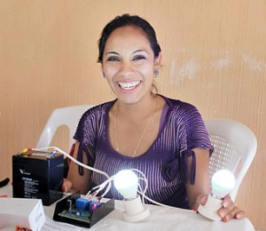
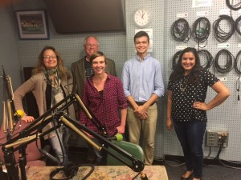
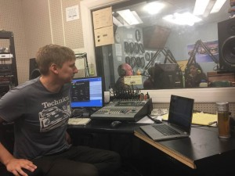

_John Barrie ,_ founder and executive director of the Appropriate Technology Collaborative, recently won recognition for that organization as one of the [Sustainia Top 100 Sustainability Solutions of 2016](http://www.sustainia.me/solutions/). Why? Because they create new sustainable technologies that promote economic growth and improve the quality of life for low income people worldwide.

To celebrate, consider coming out this evening from 6pm onwards at the [Zingtrain event space](https://www.zingtrain.com/about-us) in Ann Arbor. You may know Zingerman's as INC. magazine's "coolest small company in America."  We know them as good food and drink, but that will be combined tonight with show and tell of cool technologies in ATC's trademark two way street of sustainable development, teaching and learning across continents by living together and, as Barrie puts it on air, "learning to fail fast, so we get to designs that WORK." 

But we digress. Today on our show, to a soundtrack of Guatemalan tunes from hip hop/slam to metal,  Monika _Goforth_, Guatemala Program Director for ATC,  joined  hosts _Chris Askew-Merwin_ and _Malavika Sahai_ to discuss their award winning Mayan Power and Light program, bringing solar power and equitable business solutions to rural Guatemala. Listen to _John_ and _Monika_ describe the impact this work has had on the health, wealth, and self-determination of women as young as sixteen who are able to become role models in their communities, learning new technologies and business models. If their passion excites you (it excited us...John and Monika raced out of the studio saying to each other "epoxy...we need to get back to Zingtrain with epoxy before cocktail hour!") then check out their website at [apptechdesign.org](http://apptechdesign.org/) or their [facebook](https://www.facebook.com/AppTechDesign/?fref=ts) to see how you can get involved locally or abroad.

And we'd be remiss not to mention that Audio Engineer Ed Waisenan held it down  in the booth, with his trademark approach to keeping it humble, yet hot. If that doesn't "sustainia" we don't know what will.
