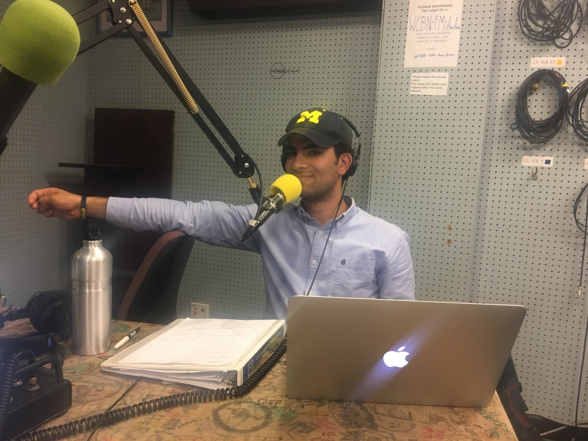

Travel back with us to the hot month of June 2010 in Baltimore, Maryland. Commissioner Douglas Nazarian, Chair of  the Maryland Public Service Commission (MPSC) is in the hot seat. He is considering whether to approve a  proposal from Baltimore Gas and Electric (BGE) to use a 200 million dollar budget granted by the Department of Energy to  roll out smart meters across their service territory and to institute a new electricity pricing plan that would rely on the meters.

Smart meters, an upgrade from the traditional analogue electric meters, have been heralded as a key step towards the elusive smart grid. They are designed to facilitate communication between end users and utility companies, to help individuals and communities save on electricity, to help utility companies cut operational costs, and to decrease the risk of costly and life-threatening blackouts during peak summer demands. They are typically considered a win-win-win for electric ratepayers, the utility company, and the environment.

Yet many consumers fear privacy violations, health impacts, and other downsides to deploying this new technology.  What will Doug decide? Today's broadcast features the audio recording and editing work of "Mad Genius" Ed Waisanen, working with Gianna Petito. Gianna is a co-author on this case with Arman Golrokhian (in studio today!)  and Geoffrey Burmeister, and the faculty advisor for the case is economist Michael Moore.

Listen in with us for more than just great tracks from Nina Simone and Rod Lee about Baltimore, but also for Doug's reflections on his decision making, as well as conversations with Paula Carmody of the People’s Council for Maryland, who represented  the interests of ratepayers in that turning point for a town with a lot of governance challenges.  A final subject, Kim Curry, is an attorney in the General Council office  for BGE, and she emphasizes the need for the company to profitably provide electricity to ratepayers. Discover firsthand how each actor played roles and perceived Doug and his commission's decision first to block the proposal,  then to accept a modified version that took into account key ratepayer concerns.

With this blogcast we are showcasing the audio component of this [Michigan Sustainability Case](http://learnmsc.org), one in a series of new approaches to case based teaching and learning  that use audio and visual imagery alongside text and engaged teaching techniques to expand the appeal and traction of sustainability science beyond traditional learning methods, and beyond classrooms into civic, commercial, and community contexts.  

While this case narrative evokes the 2010 as the present, the podcast continues beyond this decision-point, allowing the actors involved to reflect on the events of the past in light of the present and vice versa, in effect updating the case, and inviting users to enter the learning platform as both learners and contributors to what is an updatable, dynamic case for forward learning on this topic.
