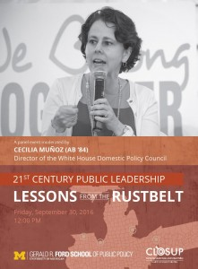

Did you miss the live broadcast for the fantastic panel event chaired by _Cecilia Muñoz_, Director of the White House Domestic Policy Council (and an University of Michigan alum)? This panel consisted of public servants from rebounding Midwestern cities, including a former It's Hot In Here host, _Kerry Duggan,_ Deputy Director for Policy at the Office of the Vice President, who talked about place-based work in action on the ground in Detroit, MI; Gary, IN; and Youngston, OH. The panelists shared how their localities collaborated across local, state, and federal levels to make progress on long-standing issues in their communities, such as pervasive blight, crime, poor community trust in law enforcement, chronic homelessness and more.  Watch the full panel at [http://fordschool.umich.edu/video/2016/21st-century-public-leadership-lessons-rustbelt-panel](http://fordschool.umich.edu/video/2016/21st-century-public-leadership-lessons-rustbelt-panel).

