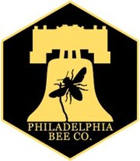

On this week's episode of It's Hot in Here, Rebecca Hardin and Malavika Sahai sit down with Don Shump of the [Philadelphia Bee Company](http://philadelphiabee.com/) to discuss traditional and urban beekeeping practices, as well as the challenges beekeepers face in this day and age.

Don started The Philadelphia Bee Company in 2007, and has been dedicated ever since to providing residents access to honey, wax, and pollen all harvested within city limits, as well as educating  Philadelphians about the importance of bees and other pollinators.

This riveting discussion includes segments on the conservation status of bees, how urban areas are adopting specialized techniques to safeguard pollinators, the ongoing debate on hive medication, and much more.

Rich Wieske of [Green Toe Gardens](http://greentoegardens.com/site/) also calls in to discuss bee activity in his hives, and we revisit a conversation from a previous It's Hot in Here episode, [Buzzfeed: Wild Bees Meet Urban Farming](http://www.hotinhere.us/podcast/buzzfeed-wild-bees-meet-urban-farming/) about colony collapse and wild bee species.

We really enjoyed having Don in our studio, and we hope you enjoy this episode of It's Hot in Here.
