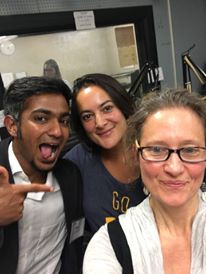

On today's episode of It's Hot In Here, Rebecca is joined in the studio by Ajay Varadharajan, a graduate of UM's School of Natural Resources and Environment, now founder and CEO of [Green Insights in Amsterdam.]("http://www.greeninsights.org/#home)  Ajay and his company are helping businesses and consumers asses their environmental impact and improve their carbon footprint. Rebecca, Ajay, and guest host [Leanna Hosea](https://www.youtube.com/watch?v=yCbabTU43JI) discuss global coffee trade, competing viewpoints on sustainability, and the development of his carbon tracking apps like [GreenSwapp.com](https://greenswapp.com/)

We also sample Ghislain Dubois who [came into the studio last summer](http://www.hotinhere.us/podcast/carbon-confidential-calculating-and-changing-our-footprints/) for "Carbon Confidential," a discussion of his environmental consulting company [TEC, based in Marseille](http://www.tec-conseil.com/).  Along the way, Ghislain introduced us to a master sampler, the DJ and artist Goldenberg and Schmuyle, whose track "tout, tout, et tout" reminded all of us at IHIH of our own efforts (je melange tout...i mix everything together). Check out his video [Zazou Bar](https://vimeo.com/105095480?ref=fb-share&1) for an "electric" hit of the Marseille culture Ghislain describes in the neighborhoods around his consulting company's office.

Meanwhile, back among the  canals and bicycles of Ajay's Amsterdam,  this whole conversation spotlights the trend towards sustainability at more personalized scales. Ajay and Ghislain are both processing large data sets for organizations, but also developing apps and approaches to put data at the fingertips of individuals who want to "track" their environmental impact like they do their financial or physical fitness. You can reach either of them on their websites. They are often hiring, and always looking for interns, analysts, and collaborators. In the meantime keep it tuned to IHIH where we track  trends going on in Europe and other parts of the world. We hope you enjoy this episode, masterfully edited by Patrick Conway.
