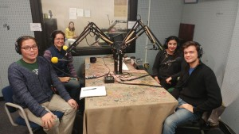

In the first of our three-part series on the Standing Rock protests we invited two Native American activists and graduate students from the University of Michigan, _John Petoskey_, JD candidate and _Katherine Crocker_, PhD candidate to join hosts _Malavika Sahai_ and _Chris Askew-Merwin_ to have a discussion on the evolution of the protest and its place in the larger scope of indigenous rights. Listen and learn about the injustices caused by the Dakota Access Pipeline but also about the threats posed closer to home by Line 5, an oil pipeline that cuts through the Straits of Mackinac. This show explores the legal framework behind Native American protests as well as a fascinating discussion on the responsibility of STEM academics to engage in political and ethical activism. Tune in also for the fantastic music from Native American artists such as Ojibwe rapper Thomas X, Ojibwe / Anishinaabe & Xicano emcee Sacramento Knoxx, and Cree rapper Drezus among others. We hope you enjoy the show and tune in later this month as we put out parts two and three.

