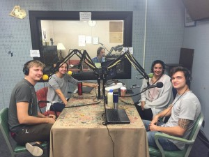

Tune in for an update and discussion from the first week of the 22nd session of the Conference of the Parties (COP 22) in Marrakech, Morocco. Graduate students _Ember McCoy_ and _Ed Waisanen_ from the School of Natural Resources and Environment at the University of Michigan join hosts _Malavika Sahai_ and _Chris Askew-Merwin_ to discuss their perceptions and experiences on the ground at COP 22 in Marrakech. Hear how the representatives from around the world reacted to the news about the surprising presidential election. But this isn't all doom and gloom. We delve into _Ed_ and _Ember_'s experiences as well as clips from a few interviews they conducted and find reasons to be optimistic for the future of the environmental movement and for the fight against climate change. The discussion moves between the happenings at COP 22, the election, climate finance, international relations and even a few bad puns. You sure don't want to miss this one!

From left to right: Ed, Ember, Cameron (our wizard of a producer), Malavika, and Chris
