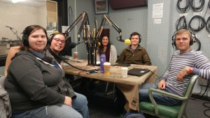

In the third part of our Standing Rock series hosts _Malavika Sahai_ and _Chris Askew-Merwin_ are joined in studio by returning guests _John Petoskey_, JD candidate, and _Jens Lund_, a visiting scholar from Denmark. We are also joined by _Becca Lynn_ a University of Michigan student getting her BA in Sociology. In this segment we discuss the recent progress made at Standing Rock through the efforts of water protectors and debate whether this is major victory or just an incremental piece of progress. _Becca_ shares first-hand experience from Standing Rock and explains how the water protectors have organized themselves and their actions. We debate the impacts that the new presidential administration may have on this struggle, how similar struggles play out in other environments, and how recent political changes are impacting the morale and resolve of the water protectors and their supporters. Tune in also for the amazing Native American and First Nations music we jam to including songs by Sacramento Knoxx, A Tribe Called Red, and Thomas X.

