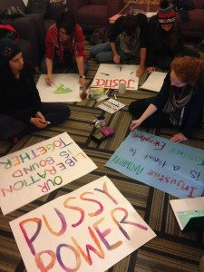

This inauguration weekend is coupled with an act of resistance: a Women's March on Washington with sister marches happening across the globe in solidarity with socially marginalized individuals under a Trump presidency. Traveling all the way from Ann Arbor to be a part of the action are a group of students from our own School of Natural Resources and the Environment at the University of Michigan who were compelled to demonstrate to defend women, the environment, and environmental justice.

Making posters for the march

Our guests _Sindhu Bharadwaj_, _Tyler Fitch_, and _Katie Williamson_ reached out to friends in the area for housing, collected their coins for transportation, and made a plan to trek to D.C. and on today's show discuss some of the nuances of an anti-oppression vs pro-justice framework for social movements. They also critically speak about parallels between The Women's March and Occupy Wall Street, the impact of activist art, and strategies for keeping up energy and momentum for movements. A lot to take in, including some excellent music from Sleigh Bells, Aimee Mann, and the Dixie Chicks, you won't want to miss this episode!

_Cover photo taken by James Bourland at the Women's March in Chicago_
