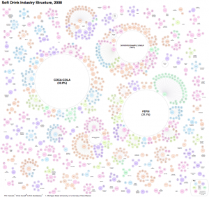

In this week’s episode co-hosts _Chris Askew-Merwin_ and _Malavika Sahai_ talk food and power, with a focus on corporate control over the food industry. This conversation is based on an interview we air between Malavika and guest _Phil Howard_ from Michigan State University, a professor and sociologist studying food markets and food systems. He has a new book out, entitled _Concentration and Power in the Food System: Who Controls What We Eat?_, and is perhaps most famous for his widely-circulated [infographics](https://msu.edu/~howardp/infographics.html) about concentration of ownership in the food system. They talk taking back power through consumer purchasing power and sustainable movements in pre-existing markets.

The conversation between Malavika and Phil got us thinking about a previous show we had on sustainability in the craft beer industry, from November 2015. We review a clip from the episode, [A Cultural Shift to Conservation](http://www.hotinhere.us/podcast/a-cultural-shift-to-conservation-craft-beer-in-michigan/), with Kris Spaulding of [Brewery Vivant](http://www.breweryvivant.com/) in which she discusses being a LEED certified brewery and profit sharing at Brewery Vivant.

Along with these fabulous content-rich interviews, we play some groovy tunes from Weird Al Yankovic and The Beatles. If you love the content we provide on It's Hot in Here, [please consider donating to WCBN during our fundraising week.](http://wcbn.org/donate) There are some pretty neat premiums being offered in exchange for donations, and it's your support that helps us continue to bring you this show!

\[caption id="attachment\_1597" align="alignnone" width="300"\] One of Phil Howard's infographics on corporate power in the food industry. This one is on the soft drink industry, and Malavika and Chris discuss it on air on this week's show! For more information like this, check out his website https://msu.edu/~howardp/\[/caption\]
