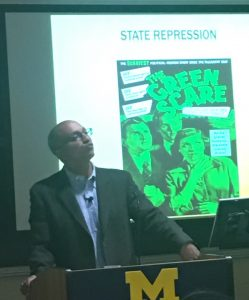

David Pellow has long been defining and then turning around and redefining work on environmental injustices. Pellow himself struggled and worked to get through college, attending multiple universities, but by the time he hit his stride as a young scholar it was clear he would shape fields. His first project led to the book  [Garbage Wars,](https://mitpress.mit.edu/authors/david-naguib-pellow) and targeted occupational and community health hazards of waste processing  in Chicago, tracing the trouble with first dumps, then incineration, and even recycling.  For a generation of environmentalists who will no longer face the choice between problems and solutions, but rather will have to face the problems WITH the solutions, David's work is a road map.That map leads us not only into the lives of those working in the waste processing plants of Chicago, but also into those of workers in Silicon Valley where Pellow himself worked briefly.   His books tackling this topic include both  The [Silicon Valley of Dreams](https://nyupress.org/books/9780814767092/)  and the later work [Ch](http://www.temple.edu/tempress/titles/1788_reg.html)[allenging the Chip](http://www.temple.edu/tempress/titles/1788_reg.html). They point to the challenge of making corporations truly accountable for the human damage created in electronic capitalism.  But they also reveal the creativity and resilience of activist networks and the advocates, attorneys, journalists, and researchers who support them.

Documenting exposure to harm is a strong pillar of environmental justice scholarship, but Pellow has also followed the lead of our own [Dr. Dorceta Taylor](http://www.snre.umich.edu/research/faculty/dorceta_taylor) in building out how the environmental justice framework relates to conservation and landscape.  His book The [Slums of Aspen](https://nyupress.org/books/9780814768037/) with Lisa Sun-Hee Park describes the  ways that immigrant labor is embedded in ski resort aesthetics and services, but also blamed by patrons and public officials for environmental damage.

Chris Askew Merwin relates these questions of environmental privilege to the violence of conservation in Tanzania's game parks, where residents are displaced for tourism. That makes Malavika's riff on the Cold Play video Paradise, seem all the more relevant.  With lyrics about gender inequality, and images of animal captivity and escape, the song begs the question: can you sing along with "intersectionality?"

\[embed\]http://https://www.youtube.com/watch?v=1G4isv\_Fylg\[/embed\]

If not, just say [Total Liberation](https://www.upress.umn.edu/book-division/books/total-liberation), the title of one of Pellow's latest books on the animal rights movement as it blends advocacy for and value of animal life with visions of human freedoms from corporate domination or state repression. You might recall our [recent convo  on  Trump Era Work on Clima](http://www.hotinhere.us/podcast/advancing-sustainability-in-the-trump-era-a-discussion/)[te Change](http://www.hotinhere.us/podcast/advancing-sustainability-in-the-trump-era-a-discussion/) , where we debate the power of single issue campaigns versus the imperatives of intersectional causes.  Let's face it, most of us don't lead single issue lives. And no matter how we think about it, there is a lot of work to do. Thanks, Dr. Pellow, for showing us how it gets DONE.
