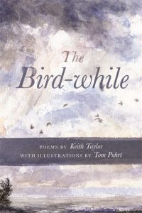

_Keith Taylor_, a celebrated local writer, poet, and teacher joins host _Chris Askew-Merwin_ in studio to explore nature and environmentalism through the lens of poetry. Born in British Columbia, _Keith_ shows us how his travels through some of the most remote and wild places in the world have shaped his work and his mindset. Listen as we discuss the role that art has played and continues to play in the environmental movement. However, the true pleasure of this show lies in the beautiful readings _Keith_ delivers from his latest book of poetry, _The Bird-while_.

Ever wanted to know how to tell the tracks of a black bear from grizzly bear? Could there be wolves roaming the lower peninsula of Michigan? Curious how long it would take you to leave civilization behind? Don't wait to find out the answer to these questions and more.

For more information on _Keith Taylor_, including books, bio, and upcoming readings head on over to his [website](http://www.keithtaylorannarbor.com/).
