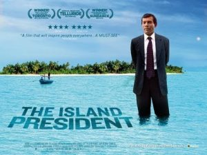

On March 6th  the Donia Human Rights Center a the University of Michigan sponsored a panel discussion with the world recognized human rights activist and politician, _Mohamed Nasheed,_   as well as UM Law graduate and celebrity human rights lawyer _Jared Genser,_  and our own _Rebecca Hardin__._  Genser has been co-counsel with _Amal Clooney_ in defending _Mr. N__asheed,_  the first democratically elected president of the Maldives. Why?

Originally a journalist,  Nasheed describes here how he spent years challenging the authoritarian government controlling his country. He was repeatedly imprisoned and tortured in retaliation for his courage. In simple, measured words Nasheed cautions us that there will always be those in power who will do that, but that every day citizens must nevertheless stand up for their rights and for the planet.  In 2008 the Maldives elected _Mr. Nasheed_ in their first free and open election. But as _Dr. Tsutsu_i explained in the panel introduction,  a coup in 2012 ended his presidency and he was unjustly imprisoned once again. _Jared Genser_ took on _Mr. Nasheed_'s case and managed to free him, getting him to England for asylum.

Throughout _Mr. Nasheed's_ political career he worked tirelessly to bring attention to the threat the Maldives face from climate change. A low-lying island nation in the Indian Ocean, the Maldives is very sensitive to sea-level rise (for more on this see our [small islands, rising seas](http://www.hotinhere.us/podcast/small-islands-rising-seas/) podcast).   A documentary chronicling _Mr. Nasheed's_ life was produced in 2011 entitled "The Island President."

Listen to the end of this podcast to hear Hardin speak in studio with hosts _Malavika Sahai_ and _Chris Askew Merwin_ about the tension and courage evident between this dynamic duo of activist and attorney, facing another round in their efforts to reinstate representative political process and climate adaptation to the island nation. The panel was broadcast live on a  Maldives television network, to announce Nasheed's intention to return there and again run for president. That's right, it is a small hot world where  _Malé_  and _Ann Arbor_ are the first to hear details of Nasheed's next moves.

For more information on the panel and each panelist read [here](http://www.ii.umich.edu/csas/news-events/events.detail.html/39089-7679781.html). To watch the full panel click [here](https://www.youtube.com/watch?v=HtgrE7Nf0qg). For more information on the documentary visit this [website](http://theislandpresident.com/).  Most importantly, to keep up with Mr. Nasheed's next move, follow him on [facebook](https://www.facebook.com/PresidentNasheed/).
