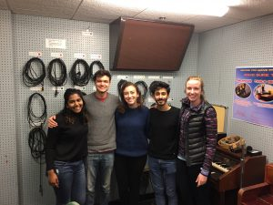
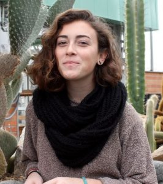
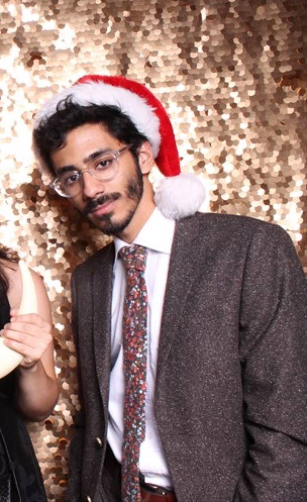

Are you interested in developing the skills you need to be an effective activist and organizer? Then you should check out this episode of It's Hot In Here where we chat with students organizing a student-run teach-in at the University of Michigan called Onward: A Student Power Summit. Hosts Chris Askew-Merwin and Heena Singh (in her first IHIH appearance) sit down with three members of the Onward team to discuss their goals and experiences with the creation of the Onward summit as well as their hopes for its impact on student organizing and activism at the University of Michigan and beyond.

Emily Zonder is a sophomore in LSA and a passionate student organizer for social change. With a strong belief in the the power of meaningful connection and mutual understanding she joined the Onward team and became one of the core organizers of the event. Emily wants to empower the people around her to not only build, but to build together; as she is of the mindset that there is nothing more powerful than coalitions of individuals and communities fighting for the future they wish to see in the world.

Emmad Mazhari is a student in Economics who is interested in identities and how they manifest in interactions – mostly in inequitable ways – and how we can become more aware of the spaces we take up, physically, socially, and virtually. He will be using this experiences to facilitate a workshop entitled Taking up Space vs. Adding to a Space where he hopes to help students consciously assess how they are engaging in a group setting and whether they should step-back, or step-up.

Laura Murphy is  senior in mechanical engineering and the CEO and Co-Founder of Adapt Design, a disability design company. She is passionate about creating beautiful products that facilitate emotional and physical independence for people with disabilities. With this experience she will be facilitating an Onward workshop on Modeling and Communicating Your Innovative Ideas where she will be helping students learn how to make physical representations of their ideas. No previous art or crafting skills required.

To learn more about Onward: A Student Power Summit check our their [facebook](https://www.facebook.com/events/1789280068061957/) event page. And if this show and the work these phenomenal students are doing has convinced you to attend (which you should!) click [here](https://docs.google.com/a/umich.edu/forms/d/e/1FAIpQLScoLoCXuW6LqD3LgZJyQ3yH5ewPr2z7mkuRIuABuOFx9WPGsA/viewform?c=0&w=1) to register.
