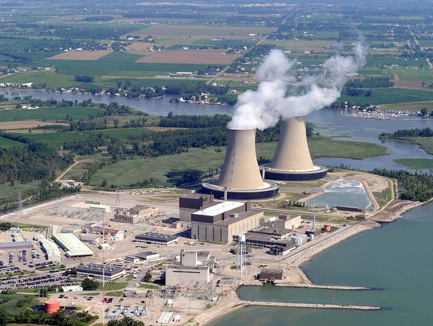

And the hits just keep coming... this week we feature our latest release in the Michigan Sustainability Case lineup, "[A Radioactive Decision: Should DTE Energy Build a new Nuclear Reactor in Michigan?](https://www.learnmsc.org/cases/dte-fermi-iii)"

Case authors Brittany Szczepanik and Bhuvan Neema join regular IHIH host Chris Askew-Merwin to unpack their podcast, provide insight into the interview process and production, and discuss how their opinions on nuclear energy have changed... or been reinforced.

The MSC podcase stands alone as a great resource to hear and analyze competing views of nuclear energy, but this candid radio conversation takes it to a new level. The  show gives new insight to those who have read the case and are trying to decide what DTE should do, and it also grants an introduction to a pressing topic in the sustainability realm.

\[caption id="" align="alignnone" width="534"\] Photo courtesy DTE, via Detroit Free Press\[/caption\]

If this discussion has piqued your interest in nuclear energy and its ongoing debate, It's Hot In Here has some excellent shows to compliment this one.  A previous [interview with Satsuki Takahashi](http://www.hotinhere.us/podcast/09-11-2015-fukashima-and-fisheries-responses-to-environmental-disaster-in-contemporary-japan/) about life in Japan, post Fukashima Meltdown, is a great insight into the pros and cons (but mostly pros!) of nuclear power. In addition, the [Captain Planet](http://www.hotinhere.us/podcast/the-power-is-yours-popular-environmental-narratives-and-the-legacy-of-captain-planet/) episode, recorded and edited by Ed Waisanen, is another great discussion of the impact of nuclear energy on our planet.

If you enjoyed this style of radio show, be sure to check out our previous Podcase Conversations. One featured the financing of the  [Birds Head  Marin Conservation Area in Indonesia.](http://www.hotinhere.us/podcast/financing-biodiversity-conservation-the-case-of-the-birds-head-seascape/)  Another honed in on the political and economic struggles behind the rollout of ['Smart Meters 'in Baltimore, Maryland.](http://www.hotinhere.us/podcast/baltimore-an-msc-podcase-conversation/) And more recently, a conversation focused on the tribulations and contributions of the  [Michigan Urban Farms Initiative](http://www.hotinhere.us/podcast/farming-in-motown/) in Detroit.

Stay tuned for more, and find more information about how to make or use cases at [www.teachmsc.or](http://www.teachmsc.org)g or see our whole case catalogue, available open access at [www.learnmsc.org](http://www.learnmsc.org).
