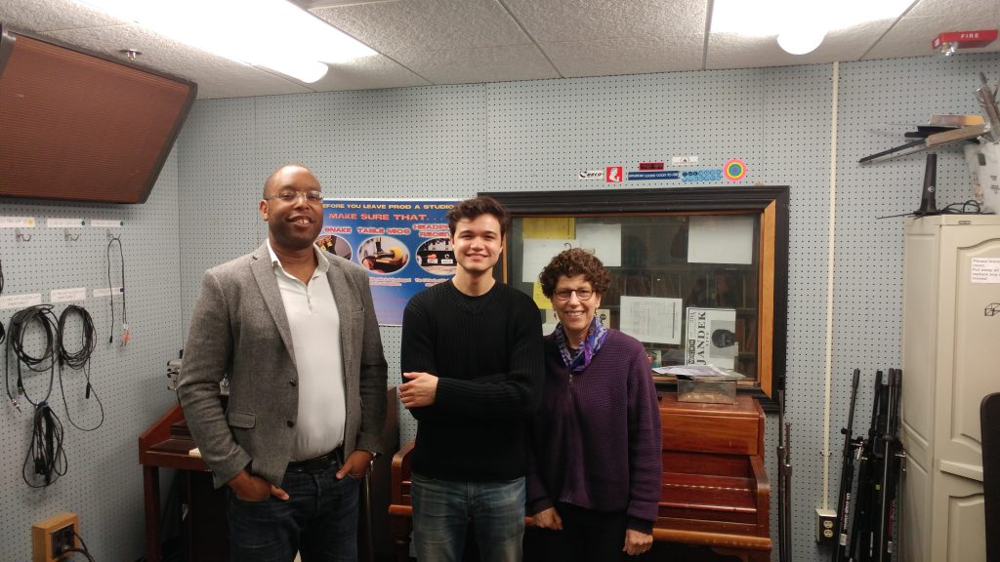

In this week's episode of It's Hot in Here, host _Chris Askew-Merwin_ is joined in studio by two esteemed guests to explore the fashion industry's impacts on the environment and on the workers who manufacture the apparel and shoes we all consume.

_Dr. Linda Greer_ is a Senior Scientist at the Natural Resources Defence Council and the Interim Director of the University of Michigan Biological Station. In 2009 she launched the NRDC's [Clean by Design](https://www.nrdc.org/resources/clean-design-apparel-manufacturing-and-pollution) program to address the [environmental impacts of the fashion industry](https://www.nrdc.org/stories/fixing-fashion-industry).

Our second guest, _Dr._ _Damani Partridge_ is a professor at the University of Michigan in the Departments of Anthropology and Afroamerican & African Studies. Dr. Partridge has recently been researching how new corporate ethics such as fair trade are changing the relationships between corporations, consumers, and the workers along the global corporate supply chains. To read his article on this topic click [here](http://www.journals.uchicago.edu/doi/10.1086/657256).

Fashion is a multi-trillion dollar industry with over one trillion dollars spent per year around the globe on clothes and footwear. Of that trillion, $370 billion is from the United States alone. Such a huge industry has to have an enormous environmental footprint. Add to that the terrible working conditions that plague the industry, and fashion becomes a major problem that needs solving.

Tune in to listen to the experts on how the fashion industry can be influenced. Should we vote, vote with our wallets, or protest in the streets? Short answer, all of the above. For the long answer, check out the show.
