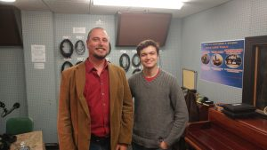

This week's hosts _Rebecca Hardin_ and _Chris Askew-Merwin_ explore notions of property and ownership on Earth, in virtual  reality like games, and in Space--literally beyond he boundaries of planet earth.  Our guide through this journey is _Professor Wian Erlank_, an expert on property law from North-West University, located in Potchefstroom, South Africa.

Vian likes to puzzle over questions like: Do we own our virtual goods such as ebooks or mp3? Is that property certificate for a piece of the moon legitimate? 

_Professor Erlank_ joins us while on a break from the 8th Annual Meeting of the [Association for Law, Property & Society](http://alps.syr.edu/). This conference brought together people from many disciplines and from around the world to encourage dialogue on issues of property law ranging from affordable housing to water rights and large scale land transactions. Conference attendees (pictured above) visited Detroit's urban farms and community revitalization projects to get a glimpse of property in practice, and to confer with local leaders on the ways they are confronting the challenge of property rights in their work.  For more information on the conference click [here](http://alps.syr.edu/annual-meeting/).
