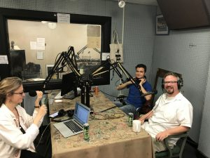
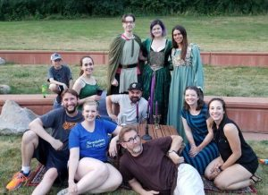

Our story begins One Dark Night…

For those in the know, a repertory theater without a show staged that evening is experiencing a "dark night." Back when [Joseph Zettlemaier](http://www.jzettelmaier.com) was a young intern from Georgia at the famed Purple Rose Theater in Chelsea, Michigan, such down nights were dedicated to letting the wider production team try their hands at producing, directing and acting, through "Apprentice Dark Nights." Joe wrote a bit, his friends and fellow apprentices acted it out.  Now Joe is a playwrite, director, teacher, mentor, and member of [Roustabout Theatre Troupe](http://roustabouttheatre.com/) which sponsors popular [new play readings and events](http://www.encoremichigan.com/2017/05/roustabout-theatre-troupe-seeks-new-scripts-crooked-tree-festival/) in his new home of Milan, Michigan. And it is mostly because established actor and mentor [Jeff Daniels](http://www.mlive.com/entertainment/index.ssf/2014/01/actor_jeff_daniels_on_why_he_m.html) said to him  that dark night: "I like it. Give me a hundred pages."

Later that same summer, says Joe, Playwrite [Lanford Wilson](http://www.npr.org/2011/03/25/134855822/for-lanford-wilson-the-plays-were-always-personal) found himself in and around Motor City...without himself knowing how to drive. Daniels saw an opportunity for Joe, and set him up as Wilson's chauffeur for a few weeks. They talked, Lanford shared insights, Joe learned, they drove.  Eventually Lanford got out of the car, but Joe kept driving toward a career in theatre, and has never looked back.

Now he is helping build out Michigan's landscape for fostering artistic community, local innovation, and excellence in dramatic arts. When [The Penny Seats Theater Company](http://www.pennyseats.org/) contacted him to ask if he had a play appropriate for performance out of doors, he knew this would be the premiere of his  "Renaissance Man." This adaptation of Shakespeare's Macbeth takes horror and turns it to comedy, set in a contemporary Renaissance Festival. Zettlemaier researched the play by traveling to Ren Fairs in Wisconsin, Georgia and throughout Michigan, and interviewing career "rennies" and local fans or participants alike. It was time to set the show in motion.

The cast features the talents of Patrick Loos, Kelly Rose Voigt, Robert Shore, David Galido, Annie Dilworth, and Julia Garlotte who is also the show's sound designer and is responsible for much of the amazingly curated music we here in the play, and on our show today (tracks from Silent Lion,  the Breton's march by Jem 'n Em, and the mesmerizing beat of Ships are Jivin' by Passages).

The show also features lots of clang-y armor from [Bent Sword Productions](https://www.facebook.com/Bentswordproductions/) in Royal Oak, Michigan. And of course it unfolds against the backdrop of grasses and cattails and lawns we Penny Seats fans have come to love on a summer evening.  One night last week,  audience members showed up in full costume and relevant regalia, like goblets, candelabras, and so on. Substantiated Rumor has it others were pouring cold Rosé to help keep audience members cool and relaxed.

The company's first Twilight show, which will open July 13, is Peter and the Starcatcher by the inimitable JM Barrie. If you want tickets  you can buy them when you arrive in West Park, or get them in advance on their [website box office.](http://www.pennyseats.org/box-office)
