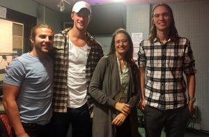

 

https://umich.box.com/shared/static/iwnz1k7lh53fmqyryeg2ijyqrw0cw2hu.mp3

When asked what was the best part of his summer internship Eric Krostich says "Basalt." No, this is not a throwback to your high school geology class, but the place where Eric made his home for the summer in Colorado.

 __

_Eric Krostich (_pictured far left_)_ is a second-year MBA/MS graduate student at the Erb Institute, a dual-degree program between the Ross School of Business and School of Natural Resources and Environment. Eric is focusing his graduate studies on energy and sustainability issues. Before coming to Ann Arbor, Eric spent four years in New York, NY working as a tax and audit CPA.  Eric received his B.A. in Accounting from the University of Wisconsin.

Desirability, convenience, and cost are the three greatest barriers to adoption of deep energy retrofits. To date, selling energy efficiency at scale has not been achieved, so only a minority of homes in the US have had a deep energy or zero energy retrofit. A program in the Netherlands known as Energiesprong has sought to overcome these barriers by facilitating and treating retrofits as a product to be delivered by industry, rather than individualized projects. The project has succeeded, retrofitting thousands of social housing units.

This past summer, Eric interned at a company called Rocky Mountain Institute (RMI), a Colorado-based non-profit think-and-do-tank that focuses on the efficient and restorative use of resources.  In coordination with Energiesprong, the Rocky Mountain Institute has started an initiative called REALIZE that plans to attempt this approach in the US. With over 137 million homes, the US is a significant market opportunity. REALIZE hopes to facilitate the delivery of comfortable, desirable, affordable, and reliable net zero energy retrofits by coordinating the value chain, removing barriers, recognizing perceived risks, and mitigating confusion and protectiveness.

Smooth, confident, and driven, it's safe to say that Eric will be creating positive change for the environment and homeowners as we move towards a new sustainable energy future.

Today we were also joined by new host Ben Sonnega, Program in The Environment undergrad, recently of [MLCV](https://www.youtube.com/watch?v=JJ-075dX-8g&index=5&list=PLUtaq2lrIyjPkq2iDikPeO1X6ZLBvVHsl&t=10s), and also former national champion men's rower at U of M.

(Pictured in center)
