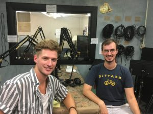

The day that the United States dropped the atomic bomb on the people of Nagasaki is one that will not be forgotten in history, but do we truly understand all of the repercussions still?

\[caption id="attachment\_1706" align="alignleft" width="300"\] Host Ben Sonnega (Left) and guest Alex Sklyar (Right)\[/caption\]

During this week's show on _It's Hot In Here_ host _Ben Sonnega_ was joined by _Aleksandr Sklyar_, a University of Michigan PhD candidate in Sociocultural Anthropology. _Alex_ told us about the website Nagasaki Atomic History and the Present (NAHP) which he created with _Georgia Butcher_ and _Benjamin Kelsey_ last summer at Colgate University. You can access [NAHP](http://nagasaki.colgate.edu/) and see for yourself!

The site features interviews with atomic bomb survivors conducted by Alex during his time spent in Japan, as well as statements from experts in the field on nuclear weapons technology. The site also features a [NUKEMAP](http://nagasaki.colgate.edu/nukemap/nukemap-explanation/) simulator that allows the user to plug in their hometown and see data like the number of casualties and the range of the blast if a similar bomb were to be dropped in the US.

In this episode _Ben_ and _Alex_ discuss everything from nuclear weapons education approaches, to cultural differences in how the history is written, to nuclear war scenarios played out in Japanese anime, taking a question or two from callers along the way.  Stream or download; enjoy and reflect on the ways we as students can also become teachers, gathering and conveying information in innovative ways.
