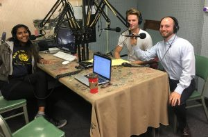

For those that care about the mitigation of climate change, it can seem like the list of institutional changes that are needed goes on and on. Luckily we have people like _Noah Feingold_ putting in the time to work on specific and measured solutions.

Noah joined Hot hosts _Ben Sonnega_ and  _Heena Singh_ today as he is starting his second-year MBA/MS graduate program at the Erb Institute. This is a dual-degree program between the Ross School of Business and School of Natural Resources and Environment. Noah is focusing his graduate studies on sustainability issues in the transportation sector. Before coming to Ann Arbor, Noah spent four years in Boston, MA working in economic consulting. Noah received his B.A. in Math and Economics from Wesleyan University in Connecticut, where he was a member of the varsity baseball team. Maybe all that hard training and teamwork makes him better able to  focus on and work toward the complex goal of green aviation?

\[caption id="attachment\_1722" align="alignnone" width="300"\] Left to Right: Co-hosts Heena Singh and Ben Sonnega, and Guest Noah Feingold.\[/caption\]

Global aviation accounts for approximately 2 percent of global CO2 emissions (some estimates find that the impact on global warming is closer to 5 percent due to water vapor and nitrogen emissions). Strong growth in the aviation industry and decarbonization in other industries could raise the 2 percent to 5-10 percent of global CO2 emissions in the coming decades. Nevertheless, aviation groups have set a goal to reduce CO2 emissions by 2050 to 50 percent of 2005 levels. The development of sustainable aviation fuels (SAF) is critical to reaching this goal.

This past summer, Noah interned at the Rocky Mountain Institute ([RMI](https://www.rmi.org/))--you remember that Colorado-based non-profit think-and-do-tank that focuses on the efficient and restorative use of resources? We talked about it in Part One of this series, [our very first show this fall season](http://www.hotinhere.us/podcast/realize-initiative/), with Eric Krostich.  Noah worked in their New York location on the sustainable aviation practice area that emerged from RMI's partnership with Sir Richard Branson's [Carbon War Room](https://www.rmi.org/carbon-war-room/).  The partnership has introduced an airport-centric model to aggregate SAF demand to in turn spur additional supply of SAF production. Noah’s research focused on the regulatory landscape around biofuels and the positive externalities associated with SAF, too often unvalued but potentially assets to an airport  guaranteeing demand of SAF.

From Frank Sinatra's "Fly me to the moon" to Steve Miller Band's "Fly like an Eagle," and even a call in from a cranky coal industry professional, this exciting episode of _It's Hot In Here_  is well worth tuning in for before your weekend gets all the way turned up.
