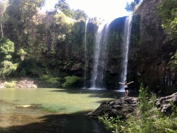
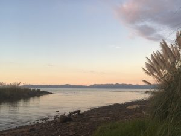

When asked to describe an average day of class at the [EcoQuest](https://ecoquest.unh.edu/) study abroad program, our guests replied, "there's  no such thing."

\[caption id="attachment\_1730" align="alignleft" width="300"\] Jessa at Whangurai Falls\[/caption\]

This week on _It's Hot__,_ adventurers   _Lauren Vesprani_ and _Jessa Webber_ joined host _Ben Sonnega_ live on air to share  one of the most exciting abroad experiences an undergraduate student could have.

_Jessa_ is a senior studying Environmental Policy with a minor in Law, Justice, and Social Change, and Lauren is a senior studying EEB, evolutionary anthropology, and Program in the Environment. Last winter, both of them attended EcoQuest, a environmental and field-based study abroad program in New Zealand. The program runs in partnership with the University of New Hampshire and invites college students from the United States  to join in an immersive semester of ecological science studies based around the ecosystems and communities in New Zealand.

\[caption id="attachment\_1731" align="alignnone" width="300"\] Beach at the EcoQuest Campus in Whakatiwai\[/caption\]

Lauren and Jessa share stories of everything from deep water diving in coral reefs, to direct encounters with leading New Zealand government officials (and even a run-in with hypothermia! Listen in for more on why this experience-based learning environment is such a wild success,  plus music from New Zealand artist _Pacific Curls_, as well as _Jack Johnson_ and _Bob Dylan._ What does adventure mean to you, _Hot_ listeners, and do you agree most of us learn best when we live the lessons?
