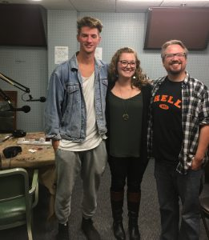

On this eerie Friday the 13th in the WCBN-FM studio, Roustabout Theatre's _Joe Zettelmaier_ and _Anna Simmons_ join host _Ben Sonnega_ for a chat about the troupe's latest production, the hilarious and haunting Dark Ride Radio Hour.

\[caption id="attachment\_1738" align="alignnone" width="261"\] Host Ben Sonnega, Anna Simmons, and Joe Zettelmaier\[/caption\]

Joseph Zettelmaier is executive director of Roustabout Theatre and is an award-winning playwright with over 20 professional productions to his name. He’s taught at Eastern Michigan University for over a decade and been produced locally and internationally. Joseph Albright is a professional actor and director, appearing both on stage and on screen. He’s also been the Theatre Director at Ypsilanti’s Corner Health Center for many years. Anna is managing director for Roustabout and currently works at the University Musical Society.

Joe and Anna came to discuss not only the origins of the theatre troupe and their latest spooky endeavor, but all things Halloween (Joe's undeniably favorite holiday) including classic Halloween rock tunes, favorite costumes, raffle prizes to be won at the live show, and much more!

Fashioned as a golden-era radio show, including live [Foley sound effects](http://roustabouttheatre.us13.list-manage.com/track/click?u=2df387dd6c02e6ce0087362dd&id=89563a1a7f&e=6b4908248c), the Dark Ride Radio Hour will feature four new horrifying radio scripts by Joseph Zettelmaier, and TWO opportunities to catch the performance! The Dark Ride Radio Hour is an immersive experience, just in time for the Halloween season. Close your eyes to image the action or watch the way these gruesome sounds are made!

Performances will take place on October 14th at [Bona Sera in Ypsilanti](https://eatypsi.com/) AND on October 21st at the [Trinity House in Livonia](http://www.trinityhousetheatre.org/), making this the very first Roustabout event to “roust” in and of itself! Go online and [buy your tickets](http://roustabouttheatre.com/coming-soon/) now as they are going fast!

Get in the Halloween spirit with Roustabout Theatre on this week's episode of _It's Hot In Here._
