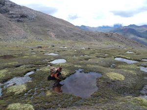

The Hot In Here team spends a lot of time considering the far reaching impacts of climate change. From warmer temperatures, to rising seas, to pollution issues of climate justice, there is MORE than enough to address. Aiming to tackle this challenge one step at a time, we had the pleasure of having [U of M Sociocultural Anthropology](https://lsa.umich.edu/anthro/subfields/sociocultural-anthropology.html) PhD Candidate _Allison Caine_ join regular host _Ben Sonnega_ and new host on the mic _Ari Weil_ for an in depth look at her time spent in the Andes Mountains.

\[caption id="attachment\_1748" align="alignnone" width="300"\] Andes Wetlands\[/caption\]

Allison’s research investigates how pastoralists in highland Peru identify, evaluate, and respond to the regional impacts of global climate change. Living in delicate wetland ecosystems at the edges of rapidly retreating glaciers, these herders pick up subtle cues in animal behavior and grassland distribution that indicate rapid shifts occurring in their  landscapes. As temperatures increase, herders find themselves facing transformative changes in seasonal variation, extreme weather events, and the vertical displacement of ecological zones.

\[caption id="attachment\_1749" align="alignnone" width="300"\] Andes Mountains\[/caption\]

Allison lived alongside the herders for a year and participated in their daily lives, studying how they made sense of their world and the ways in which it was changing. She also followed seasonal migrations between pastures to track how herding practices are shifting to accommodate changes in the ecosystem. We talk about how Allison became an anthropologist and what it was like to undertake ethnographic fieldwork in a remote Quechua-speaking community. We also discuss what anthropology has to contribute to the study of climate change, particularly in terms of its impact on people’s daily lives.

\[caption id="attachment\_1747" align="alignnone" width="225"\] Studio Selfie! (Allison, Ben, and Ari)\[/caption\]

This plus music from a woman in the community Allison stayed in can all be found in this week's episode of _It's Hot In Here_!
