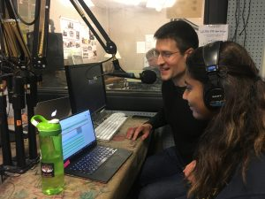
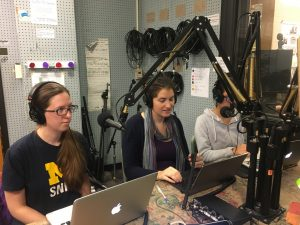
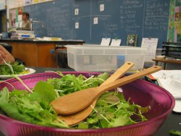

Are you concerned about climate change? Would you like to learn about how you can address and respond to this challenge - whether as an individual, by collaborating with others, or through political actions? Click play on this episode of It's Hot In Here to hear from the [SEAS](https://hotinhere.us12.list-manage.com/track/click?u=8c9ab7982d6dae1cbf42be6a8&id=ce728d5aaa&e=d66e616f76) graduate students that helped design the [Act on Climate MOOC](https://hotinhere.us12.list-manage.com/track/click?u=8c9ab7982d6dae1cbf42be6a8&id=6e50d6482c&e=d66e616f76) now available on Coursera. The course uses food, energy, transportation and cities as frames for things impacting climate change, and uses true and inspiring case studies as the subject material for discussion. We heard from the students as well as local farmer, green realtor, and board member of local sustainability initiative [The Agrarian Adventure](https://hotinhere.us12.list-manage.com/track/click?u=8c9ab7982d6dae1cbf42be6a8&id=efbf3b0eb6&e=d66e616f76), Jeff Tanza.

 

In this show listeners get a quick and dirty version of the course as we discuss all of the possible behaviors that an individual could take across these topic areas, and discuss some local events and happenings to follow-up with. This is where our friend Jeff played a particularly useful role as a member of the Ann Arbor community. We discussed his work with The Agrarian Adventure and getting kids to eat spinach happily (who would have thought), and the [Veridian at County Farm eco-village](http://www.happyhome.how/veridianatcountyfarm/). All this plus music about climate change selected by the guests](http://www.hotinhere.us/wp-content/uploads/2017/11/AgrarianAdventureGreens.jpg)

The Agrarian Adventure is hosting a brunch fundraiser to support organic farmers sharing their enthusiasm and knowledge for growing food with local classrooms. Hear about kids liking Michigan cold-season spinach and becoming garden chefs, making sauerkraut with U-M students, the herb-smell challenge, and farmer trading cards - while enjoying heirloom vegetable hash and fair-trade coffee-infused waffles with Mindo chocolate sauce. **Sunday 11/19, 10am-noon, [500 Little Lake Dr Ann Arbor](https://maps.google.com/?q=500+Little+Lake+Dr+Ann+Arbor&entry=gmail&source=g)**.
