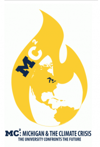

This October the University of Michigan directly addressed one of the most pressing issues of today at the [Michigan and the Climate Crisis](https://sites.lsa.umich.edu/mc2-climate-bicentennial/) conference. This week-long celebration of the University’s bicentennial was aimed at confronting the present and future of the climate crisis. The Hot In Here team was able to track down some of the speakers throughout the week for interviews. Some of these speakers include Sandra Steingraber, Stephen Mulkey, Michael Mann, and Wege Lecture guest, internationally renowned environmentalist, and founder of [350.org](https://350.org/) Bill McKibben.

Biologist, author, and cancer survivor, [Sandra Steingraber](http://steingraber.com/), Ph.D. writes about climate change, ecology, and the links between human health and the environment. Steingraber’s highly acclaimed book, _Living Downstream: An Ecologist’s Personal Investigation of Cancer and the Environment_ was the first to bring together data on toxic releases with data from U.S. cancer registries and was adapted for the screen in 2010. As both book and documentary film, _Living Downstream_ has won praise from international media.

Called “a poet with a knife” by _Sojourner_ magazine, Steingraber has received many honors for her work as a science writer, including, in 2011, a Heinz Award. By donating the cash prize to the anti-fracking movement, she became, in 2012, the co-founder of New Yorkers Against Fracking, a statewide coalition of more than 280 grassroots organizations. Steingraber has been named a Woman of the Year by _Ms. Magazine_, a Person of the Year by Treehugger, and one of 25 “Visionaries Who Are Changing Your World” by the _Utne Reader_.

 

[Dr. Michael E. Mann](http://www.michaelmann.net/) is Distinguished Professor of Atmospheric Science at Penn State, with joint appointments in the Department of Geosciences and the Earth and Environmental Systems Institute (EESI). He is also director of the Penn State [Earth System Science Center (ESSC)](http://www.essc.psu.edu/index.html).

Mann is the author of several books including his most recent work, The Madhouse Effect, which features cartoons by Pulitzer Prize-winning political cartoonist Tom Toles. Through satire, “The Madhouse Effect” portrays the intellectual pretzels into which denialists must twist logic to explain away the clear evidence that man-made activity has changed our climate.

From July 2011 through December 2015, [Stephen Mulkey](https://environmentalcentury.net/author/stephenmulkey/) served as president of Unity College in Maine, a four-year liberal arts institution dedicated to sustainability science. He led Unity College to be the first institution of higher learning in the U.S. to divest its endowment from the top 200 fossil fuel companies and directed the creation of the College’s premier graduate program in sustainability science.

As a scholar of the interdisciplinary literature in environmental science, Dr. Mulkey is an active public interpreter of climate change and sustainability. His recent research focuses on the role of landscape carbon stocks in climate mitigation and on the academic structure of interdisciplinary programs in the environmental and sustainability sciences.

[Bill McKibben](http://www.billmckibben.com) is an author and environmentalist who in 2014 was awarded the Right Livelihood Prize, sometimes called the ‘alternative Nobel.’ His 1989 book _The End of Nature_ is regarded as the first book for a general audience about climate change, and has appeared in 24 languages; he’s gone on to write a dozen more books. He is a founder of [350.org](http://350.org/), the first planet-wide, grassroots climate change movement, which has organized twenty thousand rallies around the world in every country save North Korea, spearheaded the resistance to the Keystone Pipeline, and launched the fast-growing fossil fuel divestment movement.

A former staff writer for the New Yorker, he writes frequently for a wide variety of publications around the world, including the _New York Review of Books_, _National Geographic,_ and _Rolling Stone_. He lives in the mountains above Lake Champlain with his wife, the writer Sue Halpern, where he spends as much time as possible outdoors . In 2014, biologists honored him by naming a new species of woodland gnat— _Megophthalmidia mckibbeni_–in his honor.

Throughout the interviews, a single message seemed to emerge as host Harry Rice pressed each speaker for answers. As you listen, you will hear that there was a feeling that more collaboration between disciplines must happen if we are to "get science off the shelf" as Sandra Steingraber put it. This is a direct call to action for members of not only the scientific community, but to politicians and activists alike.

These thoughtful and powerful interviews are speckled with tunes to keep you moving from artists such as [John Prine](https://www.youtube.com/watch?v=DEy6EuZp9IY), [The Tragically Hip](https://www.youtube.com/watch?v=ZaeEopDW0V4), and more on this episode of It's Hot In Here.
