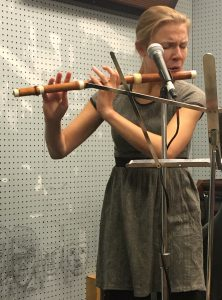
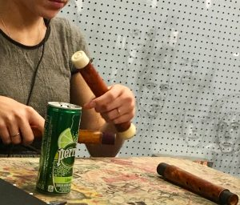
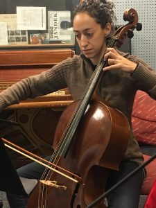

This week on _It's Hot In Here_ radio, those lucky enough to enter the WCBN studios were greeted by the warm and rich tones of the cello and baroque flute warming up to play. On flute was T_aya König-Tarasevich_, who has studied music in Siberia, Freiburg Germany and Ann Arbor Michigan and now plays from New York City where she lives with her husband. On the cello was Ann Arbor native and Community High alumna _[Anna Steinhoff](https://annasteinhoff.com/about-2/)_. Described by critics as “soulful,” and “the rhythmic heart of the ensemble", she has studied music at Oberlin and Northwestern University. She is still currently based in the Chicago area. Also joining us on the mic is pianist _Shin Hwang_. Shin is a prize-winner of the 1st International Westfield Fortepiano Competition, and a versatile keyboardist who has won recognition in both modern and historical performance. After completing his master’s degree at the University of Michigan with Penelope Crawford and Arthur Greene, he received the prestigious Fulbright Grant to study in the Netherlands at the Royal Conservatory of the Hague. This is not Taya's first time on _It's Hot In Here_, and her past performance can be found [here](http://www.hotinhere.us/2016/04/a-musical-exploration-with-taya-konig-tarasevich/).

\[caption id="attachment\_1770" align="alignnone" width="222"\] Taya on Flute\[/caption\]

\[caption id="attachment\_1771" align="alignright" width="300"\] Taya disassembling her instrument\[/caption\]

Unfortunately Shin could not bring the hefty fortepiano into the studio, but we still got to hear from Taya and Anna both together and solo.

\[caption id="attachment\_1772" align="alignnone" width="225"\] Anna on Cello\[/caption\]

 

Between these tidbits of musical delicacy, hosts _Rebecca Hardin_ and _Ben Sonnega_ discussed with the guests the significance of historically accurate instrumentation, some of their favorite pieces to play, and their personal relationships with the music of various composers. While Haydn brought a whimsical and upbeat feeling, Bach brought a feeling of truth according to the musicians. The three will be performing this Saturday at 7pm at the First Congregational Church of Ann Arbor (608 E. William St). In the holiday spirit of giving thanks, this show is FREE. Taya mentioned that it only made sense to give a gift of thanks to the community of Ann Arbor to which they all have been a part of at some point. Don't miss out on this!
