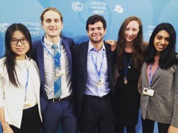
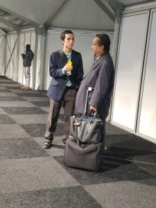
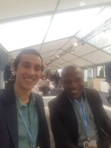

As tensions grow surrounding the U.S. pullout from the 2015 UN Paris Climate Agreement, keeping up to date on the latest negotiations is of the utmost importance. This week on _It's Hot In Here_ radio [Climate Blue](https://climateblue.org/) delegates to the [COP 23](https://cop23.unfccc.int/) UN Climate Conference Tyler Fitch and Chris Karounos joined regular host Ben Sonnega to report back on the sights and sounds in Bonn, Germany. The negotiations have taken place every year for the last 23 years with the goal of creating a unified vision for acting on global climate change.

Tyler is a second-year Masters' student in [SEAS](http://seas.umich.edu/) (School for Environment and Sustainability), studying social processes and outcomes of transitioning to clean energy. This year, he led a campaign to get the University of Michigan to sign on to the [We Are Still In](https://www.wearestillin.com/us-action-climate-change-irreversible) pledge.

\[caption id="attachment\_1778" align="alignnone" width="300"\] Tyler pictured 2nd from the left\[/caption\]

Chris is cofounder of Abaca Games and was a student co-creator of the open online course called Act on Climate. He studies Environmental Informatics and is a mycorrhizal fungus Nerd. Follow this [link](http://abacagames.org/) to sign up for early access to his climate change based video game coming in January!

\[caption id="attachment\_1781" align="alignnone" width="300"\] Chris pictured 2nd from left\[/caption\]

These two busy gentlemen were kind enough to sit down and share some of their personal stories from the weeks spent in Bonn, as well as opinions on the state of climate negotiations at the international stage. The show also includes an interview with Secretary Kijiner of the Marshall Islands conducted by Chris while he there. The interview reflects general sentiments shared by both Tyler and Chris stressing that as we work towards international agreements, it is important to keep in mind these are real lives at risk; in particular for the currently sinking island nations. This is the sad truth of climate change. Those contributing the least to global emissions are commonly suffering the most immediate and severe consequences. Despite this heart-wrenching feeling, Chris shares how uplifting it was to speak with the secretary as he thanks subnational actors in the United States for standing in solidarity with the We Are Still In pledge mentioned earlier in Tyler's bio.

\[caption id="attachment\_1783" align="alignnone" width="225"\] Chris Interviewing Secretary Kijner\[/caption\]

\[caption id="attachment\_1782" align="alignnone" width="225"\] Chris and Dr. Aminu Zakari from Zimbabwe\[/caption\]

Keep up to date with this pertinent and thought-provoking episode of _It's Hot In Here,_ rounded out with tunes from artists Car Seat Headrest, Kate Tempest, and Fiji selected by Tyler himself!
