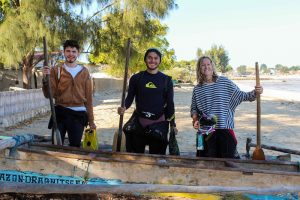
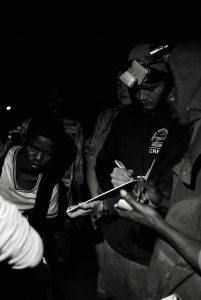
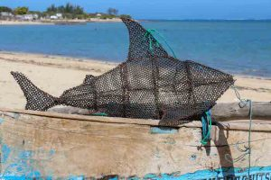

With a warm smile that filled the room, guest _Nathaniel Maekawa_ entered the WCBN studios this past Friday to tell regular host _Ben Sonnega_ about his experience as an aquaculture intern in Madagascar. Nathaniel is from Austin, TX. and is a senior at the University of Michigan studying Global Health and Environment, Medical Anthropology, and Sustainability. He enjoys writing, mountains, the ocean, and talking about dreams. Hopes to one day contribute to interdisciplinary projects that address equity, environmental conservation, and human health.

\[caption id="attachment\_1788" align="alignnone" width="300"\] Nathaniel pictured center\[/caption\]

His work in Madagascar was through the NGO [Reefdoctor](https://www.reefdoctor.org/). In the words of the organization, the mission is to "marry conservation with social development by facilitating sustainable livelihoods and education as a countermeasure to over-exploitation. Our goal is to protect both marine and terrestrial habitats, and provide a self-sustaining pathway to poverty alleviation in the impoverished rural communities of Southwest Madagascar. We have worked in the Bay of Ranobe for 15 years, establishing long-standing harmony and effective partnerships with local communities". This mission was reflected in the kindness and carefulness with which Nathaniel described his work with the Southwest Madagascar communities.

\[caption id="attachment\_1789" align="alignnone" width="201"\] Nathaniel at a midnight sea cucumber sale.\[/caption\]

Some of his work specifically included facilitating aquaculture development of sea cucumbers and creating his own version of an underwater scarecrow to ward off sea turtles looking for a snack (appropriately deemed the "scareturtle" on air).

\[caption id="attachment\_1790" align="alignnone" width="300"\] Nathaniel's shark mimic "scareturtle"\[/caption\]

Find more stories and tunes from Nathaniel's time in Southwest Madagascar on this episode of _It's Hot In Here_!
