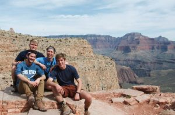
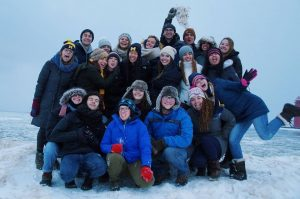

Originating in 2015, undergraduates at the University of Michigan interested in environment found a new home at the Epsilon Eta Fraternity. While there is no physical fraternity house designated on campus, _It's Hot In Here_ guests and current Epsilon Eta members Sam, Lizzie, Samuel, and Brett showed us that the fellowship and familial closeness of a fraternity was far from lost on them. They joined regular host Ben Sonnega to share their experiences with the fraternity, reasons for joining, and thoughts on a number of environmental topics. 

All four members shared a variety of experiences, but one central point that brought them together seemed to be the camping trips that the fraternity offers during the academic breaks. As social chair for the fraternity, Brett spoke on the organizing of these events, but all four guests alluded to the trips as shaping experiences in the career as an environmentalist.

If you are interested in checking out the fraternity more, click [HERE](http://www.epsilonetaumich.org/) to go to their website and [HERE](https://www.facebook.com/EpsilonEta4UM/?fref=mentions) to get to their facebook page!

 

Don't miss this fun episode filled with laughter, great environmentally geared tunes from artists like John Prine and Ziggy Marley, and powerful messages from young environmentalists!
