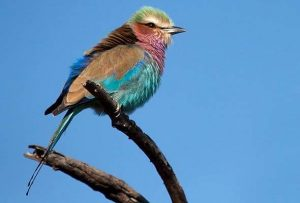
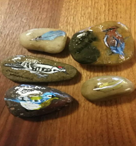
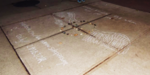
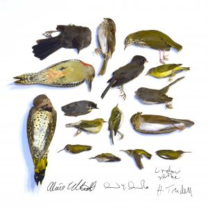

Returning refreshed from the holiday break, guests Brooke McWherter and Alice Elliot joined host Ben Sonnega in the WCBN studios to call attention to an issue often overlooked. Amidst challenges presented by changing habitats and habitat destruction, bird kills from collisions with windows can sometimes be forgotten. This is not the case for our guests.

Brooke got her Bachelors degree in Wildlife Biology before serving in the [Peace Corps](https://www.peacecorps.gov/) in Southern Paraguay as a conservation and education volunteer. While there she had the opportunity to explore the many ways we can work with and engage communities in various science topics from wildlife conservation, to geography, and even to talk about climate change. As a graduate student at the [School for Environment and Sustainability](http://seas.umich.edu/), her research is on climate resilience in rural communities in Bolivia and the connections to local wildlife as part of that resilience. When she is not working on that she acts as co-coordinator for [Art and Environment](http://seas.umich.edu/gallery) (or ArtEco) which works to promote intersections between art and science and the various ways they occur.

\[caption id="attachment\_1794" align="alignnone" width="300"\] A Lilac Breasted Roller (Brooke's Favorite Bird)\[/caption\]

Alice grew up in Ann Arbor and has a bachelor's degree in Environmental Studies. She's currently a graduate student at the School for Environment and Sustainability studying conservation ecology and environmental justice. She co-founded [Washtenaw Safe Passage](https://washtenawsafepassage.blogspot.com/) with a friend of hers to help raise awareness about how many birds hit windows and the degree to which windows are harming avian populations. Along with this program, and her graduate research, she also participates in other groups like [Science for the People](https://scienceforthepeople.org/index.php/about-sftp/) and [Washtenaw Solidarity with Farmworkers](https://www.facebook.com/washsolidaritywfarmworkers/) who are working for social and ecological change.

 Inspired by Alice’s work with Washtenaw Safe Passage, Brooke took up her own art project through ArtEco, with  Research Faculty Advisor Sarah Adlerstein Gonzalez. Painting on paperweight sized rocks, Brooke  rendered intricate and accurate depictions of Michigan birds that were found dead from window collisions  and then arranged them in a winged outline at the Shapiro Library. This installation; part arts and crafts, part performance art, part memorial,  reminded passersby to enjoy art but  also to interact with their environment and nonhuman creatures at risk within it. Sometimes, what we do not manage well, we mourn, and make into something that can be a force for greater awareness and change, magnifying the efforts of others.

\[caption id="attachment\_1815" align="alignnone" width="278"\] Painted Rocks by Brooke\[/caption\]

\[caption id="attachment\_1814" align="alignnone" width="300"\] Bird Painted Rocks Display\[/caption\]

 

The conversation included not only discussion of bird art but all forms of science and art connection such as this [water percussion performance.](https://www.youtube.com/watch?time_continue=3&v=pbjAUG3A-VI) If you are interested in natural science, the arts, and even the possible intersection of the two then this episode is for you!
