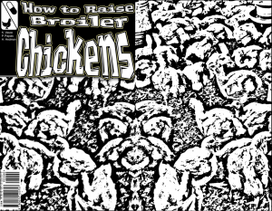
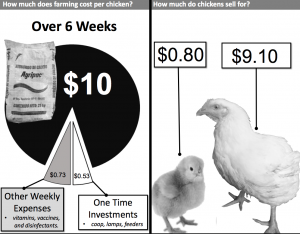
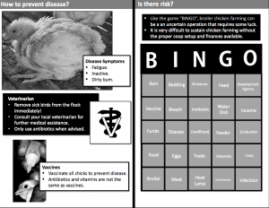

The use of antibiotics in animal husbandry has promoted not only antibiotic-resistant bacteria among livestock but also spillover between other livestock, wildlife, and humans. On this episode, guest and Ph.D candidate Hayden Hedman and SEAS graduate student Priscilla Papillas joined host Ben Sonnega and Bella Isaacs to discuss their work studying the spillover of antibiotic-resistant bacteria and how agricultural practices affect the ecology and evolution of antimicrobial resistance within a tropical agricultural setting.

First-hand stories of the data collection and lived experience from Hayden are complimented by Priscilla's experience in helping with translation duties from home. The two worked together on creating organizational sustainability in the community through education. One of these tactics was through a comic book and hosting bingo night.

\[caption id="attachment\_1844" align="alignleft" width="300"\] Images from the comic book and educational bingo game.\[/caption\]

 

Hit play to hear how antibiotic resistance is affecting livestock and what is being done about it!
