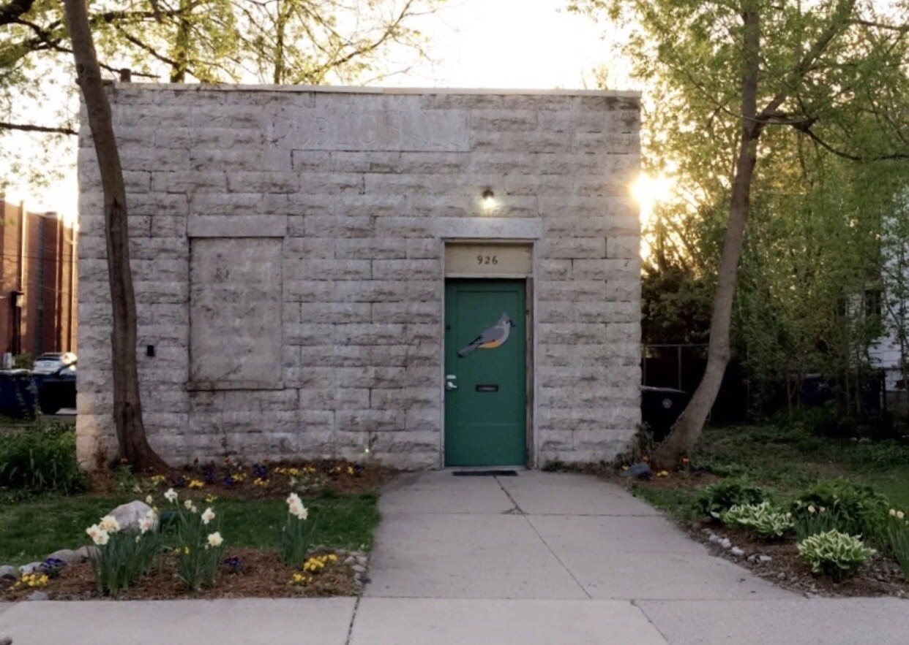
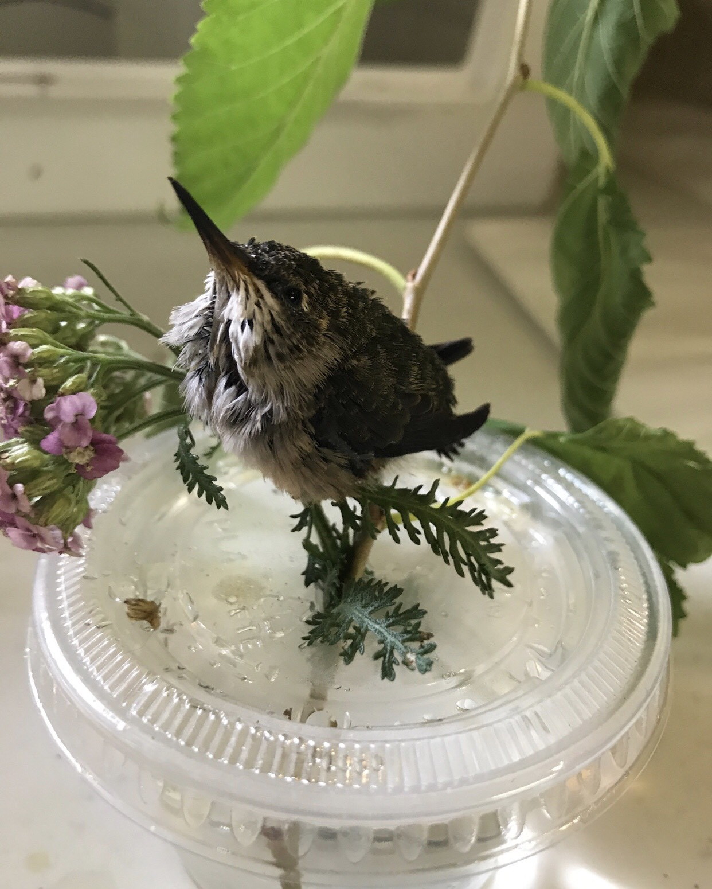
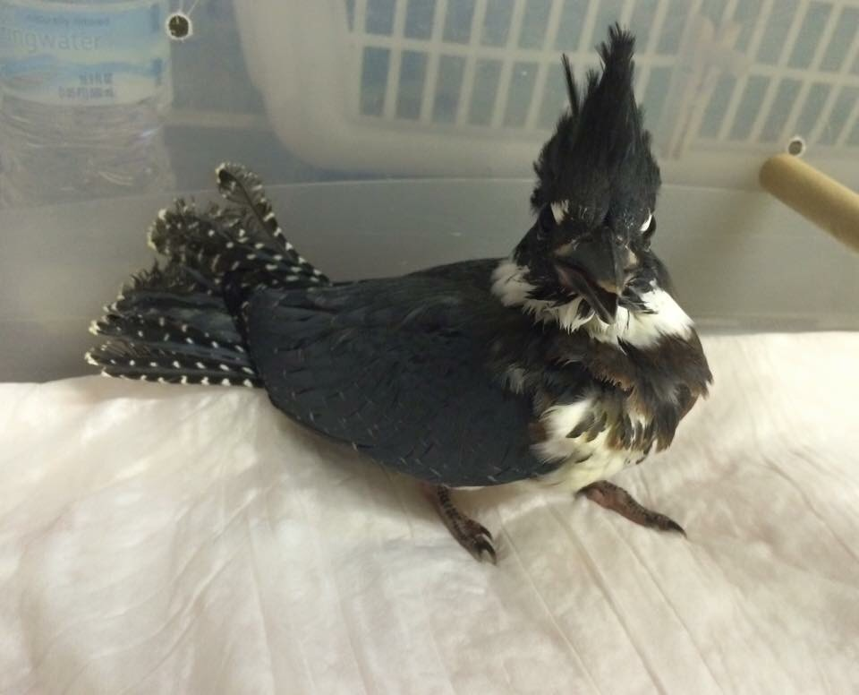

On this episode of It's Hot In Here, Andrea Aiuto of the [Bird Center of Washtenaw County](http://birdcenterwashtenaw.org/main/) joined hosts Ben Sonnega and Bella Isaacs for a casual Friday dialogue on her current work with bird rescue and how her love of birds came about.

\[caption id="attachment\_1855" align="alignleft" width="1242"\] The Bird Sanctuary\[/caption\]

The Bird Center of Washtenaw County primarily aims to aid birds, wildlife, and the environment through public education and rehabilitation. Trained staff help take in injured birds to be kept and rehabilitated at the center in Ann Arbor, as well as answer calls to help citizens learn what to do when an injured bird is spotted.

\[caption id="attachment\_1856" align="alignleft" width="1242"\] Hummingbird found in the road discussed on air!\[/caption\]

\[caption id="attachment\_1857" align="alignleft" width="960"\] Kingfisher whose mohawk Andrea adores.\[/caption\]

 

 

 

 

Click play now to hear Andrea talk about bird sanctuary work outside the US, how it is different and the same, and hear bird rescue stories from right here in Washtenaw County!

To get involved with the Bird Center, check out the [Flyaway Fundraiser on April 7th](http://birdcenterwashtenaw.org/main/?page_id=1466), and the [Volunteer Orientation](http://birdcenterwashtenaw.org/main/?page_id=804) on April 21st!
