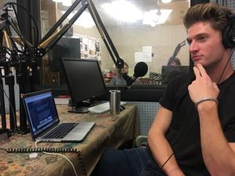
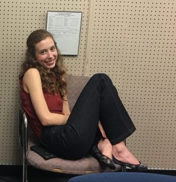
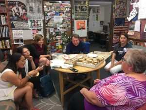

Today, we bring you an archived show from summer 2019 that Hot In Here alum Ben Sonnega recorded during the very first [Galaxy Sustainability Learning Exchange.](https://galaxy.learngala.com) 

As you may know, our show is intertwined with the Gala Platform which hosts the [Michigan Sustainability Cases](http://www.teachmsc.org) (MSC) at the University of Michigan's School for Environment and Sustainability (or SEAS). Check us out [here](https://www.learngala.com) if you’re curious.

<!--more-->

Gala hosted its second annual Galaxy conference in June 2019. This rebroadcast was timed to give 2019 participants an idea of the 2018 events (masterfully orchestrated by home-grown environmental organizer Madi Vorva, known for her campaign successes from the tender age of 12  with the Girl Scouts to get unsustainable palm oil out of their cookies. Miss you Madi; does Cambridge University have a radio studio this hot?)

This podcast is a time capsule that features the co-facilitators of Galaxy's 2019 Engaged Learning opportunity,  a Public Charette on 1,4-dioxane groundwater contamination in Ann Arbor. Working with Chemist and Curricular Innovation expert [Rachel Niemer](https://ai.umich.edu/teammember/niemer-rachel/) of UM's Academic Innovation team, Harvard's [Michaela Thompson](https://www.hks.harvard.edu/centers/mrcbg/programs/sustsci/people/research-fellows/current-fellows/michaela-thompso) and UBC's [Amanda Giang](http://ires.ubc.ca/person/amanda-giang/)  pulled together focused, creative conversations toward specs for responsively designed public information tools around Dioxane 1,4 and related contaminants in groundwater.

They could not have done it without input from Roger Rayle, a resident and spatial analysis expert who has long been documenting the plume and contributing to public debate around solutions to the health risks it represents. These members of the Dioxane team are pictured here over our in studio lunch with SEAS faculty member Rebecca Hardin, College of Nursing PhD candidate (and hot radio engineer) Meg Czerwinski,  [Laura Sullivan](https://www.kettering.edu/profile/dr-laura-sullivan) of Kettering University, and BBC journalist  [Leana Hosea](https://theintercept.com/staff/leana-hosea/).

Listen in as we break down some of the history behind 1,4-dioxane contamination in A2 and lead and legionella in the Flint water crisis, Leana's documentary film "Thirst for Justice," and Laura's experience as an educator and a Flint resident make for grounded conversations that illustrate wider principles in widespread water crises at present.  Here at home,  these exchanges remain all too relevant given that the state's Flint water investigation is ongoing and that in recent months, Ann Arbor residents were told that very low amounts of 1,4-dioxane were found in their drinking water for the first time.

As always, keep it hot, keep it here.
