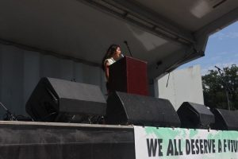
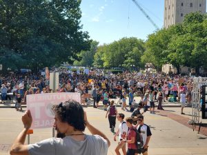
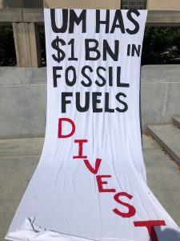

Host Bella Isaacs attended this year's Washtenaw County Youth Climate Strike on September 20 to record the speeches given by student activists on the University of Michigan's campus. That strike was part of a movement inspired by Swedish climate activist Greta Thunburg, who encouraged other young activists around the world to demand that those in power "begin acting like adults" and take action on climate change. The speakers ranged in age from middle school to grad school students and demonstrated the power of youth organization in Washtenaw County.

<!--more-->

_Photos courtesy of Naina Agrawal-Hardin_
