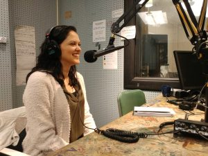

_Editor's note: We had some brief technical difficulties during the first minute of the show._ 

\[caption id="attachment\_2374" align="alignleft" width="300"\] Brittany Turner in the WCBN studio.\[/caption\]

[Brittany Turner](https://www.cheyannesymone.com/pages/who-is-she-who-are-we) is the founder of [Cheyanne Symone,](https://www.cheyannesymone.com/) a jewelry company based in Ypsilanti that specializes in handcrafted, indigenous-style earrings. She's also an energy analyst at [EcoWorks Detroit](https://www.ecoworksdetroit.org) and a graduate of the University of Michigan's School for Environment and Sustainability. Turner joined hosts Bella Isaacs and Meg Czerwinksi to talk about how she factors social justice and environmental sustainability into her business, her identity as a Native woman of the Haliwa-Saponi Tribe, how an experience at science camp sparked her interest in energy, and much more.

<!--more-->

**Cheyanne Symone will be featured at the following events in Ann Arbor:** 

Abracadabra Jewelry/Gem Gallery [Trunk Show](https://www.facebook.com/events/1529085420567508/) (December 6 and 7)

WSG Gallery [Holiday Show](https://wsg-art.com/gallery/upcoming/) (November 26-December 28)

- Opening Reception: Friday, December 6, 7:00-9:00 p.m.

**Links:**

Find Cheyanne Symone on [Instagram](https://www.instagram.com/cheyannesymone/?hl=en) and [Facebook](https://www.facebook.com/cheyannesymonejewelry/) 

[November is Native American Heritage Month!](http://www.ncai.org/initiatives/native-american-heritage-month)

- Learn more [here](http://www.pbs.org/specials/native-american-heritage-month/)

[Indigenous Identity and the Significance of the Term "Two-Spirit"](https://www.them.us/story/inqueery-two-spirit)

- [Human Rights Campaign Honors Native American Heritage Month 2019](https://www.hrc.org/blog/hrc-honors-native-american-heritage-month-2019) 

[Pregnancy and Infancy Loss Awareness](https://starlegacyfoundation.org/awareness-month/) 

[Haliwa-Saponi Pow Wow (video)](http://www.haliwa-saponi.com/media-gallery/) 

[Tashina Lee Emery designs](https://www.tashinaemery.com)

[B. YELLOWTAIL Collective](https://byellowtail.com/)

**Music:**

[Little Bit Crazy - Brooke Simpson](https://www.youtube.com/watch?v=Ja3BIEi2PdQ) 

[Hole in the Wall - Mel Waiters](https://www.youtube.com/watch?v=wRGDt8mFB28)

_Photos courtesy of Brittany Turner._
