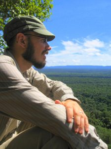

Reporter [Jeremy Hance](https://jeremyhance.com/about/) was one of the original staff writers of [Mongabay](https://mongabay.org), a non-profit conservation and environmental news site that "aims to raise awareness about social and environmental issues related to forests and other ecosystems." Hance now writes a monthly column for Mongabay called ["Saving Life on Earth: Words on the Wild"](https://news.mongabay.com/series/saving-life-on-earth-words-on-the-wild/) in addition to his freelance reporting. His feature ["The great rhino U-turn,"](https://news.mongabay.com/2018/09/the-great-rhino-u-turn/) the third installment in a four-part series on the Sumatran rhino, has been published in the [2019 Best American Science and Nature Writing](https://www.indiebound.org/book/9781328519009) anthology. <!--more-->

\[caption id="attachment\_2388" align="alignleft" width="225"\] Freelance reporter and Mongabay columnist Jeremy Hance.\[/caption\]

Hance joined host Bella Isaacs to talk about what brought him to the world of wildlife conservation reporting, the long and complicated history of efforts to save the extremely rare Sumatran rhino, and his upcoming memoir ["Baggage: Confessions of a Globe-Trotting Hypochondriac,"](https://www.hcibooks.com/p-4459-baggage.aspx) which will be available next fall.

 

 

**Links:** 

The [first installment](https://news.mongabay.com/2018/09/1984-the-meeting-that-changed-everything-for-sumatran-rhinos/) in Hance's series "The Rhino Debacle"

["How Laos lost its tigers"](https://news.mongabay.com/2019/10/how-laos-lost-its-tigers/) (Hance, Mongabay)

["The view from the bottleneck: Is nature poised for a big comeback?"](https://news.mongabay.com/2019/02/the-view-from-the-bottleneck-is-nature-poised-for-a-big-comeback/) (Hance, Mongabay)

Sumatran rhinos [sing](https://www.youtube.com/watch?v=4IrAT5mlPNk)!!!
