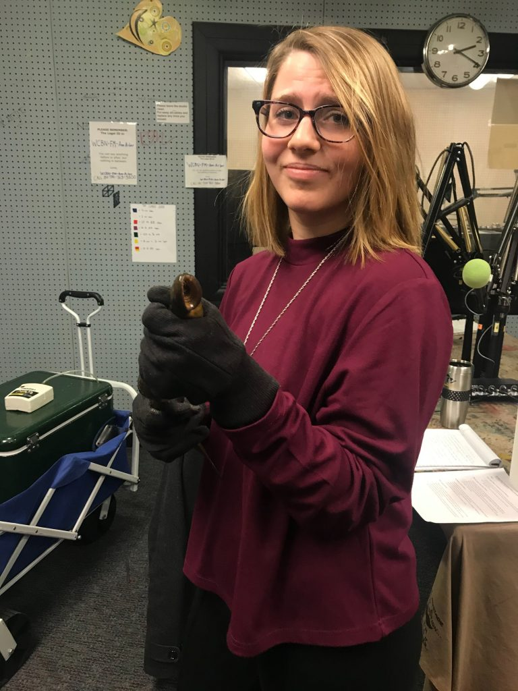
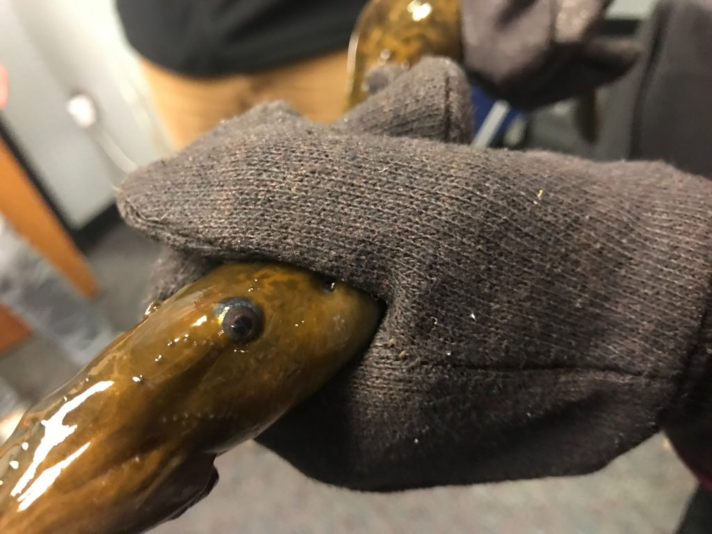

_"Nightmare. But also, cool." - Host Bella Isaacs on the sea lamprey._

[The Great Lakes Fishery Commission](http://www.glfc.org/sea-lamprey.php) is a binational organization that works to control sea lamprey populations in the Great Lakes and promote scientific research in the region. This week, Ross Shaw and Cory Brant of the GLFC joined hosts Bella Isaacs, Prachiti Dhamankar, and Isabelle Brogna to talk about why sea lamprey pose such a major threat to the Great Lakes, how the commission works to control them, and why, despite appearances, these aquatic invaders are actually pretty fascinating creatures. 

<!--more-->

- <figure>
    
    
    
    <figcaption>
    
    Ross Shaw (left) and Cory Brant (right) of the Great Lakes Fishery Commission.
    
    </figcaption>
    
    </figure>
    
- <figure>
    
    
    
    <figcaption>
    
    Host Bella Isaacs faces her greatest fear: touching fish (the gloves helped).
    
    </figcaption>
    
    </figure>
    
- <figure>
    
    
    
    <figcaption>
    
    The steely gaze of an aquatic murderer.
    
    </figcaption>
    
    </figure>
