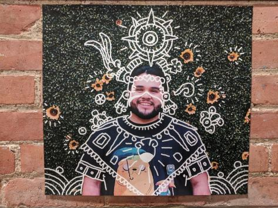
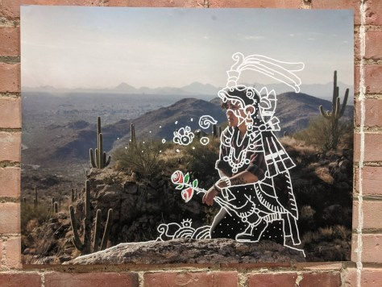
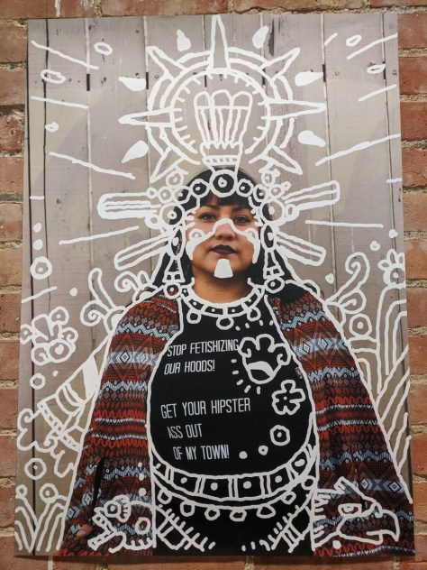
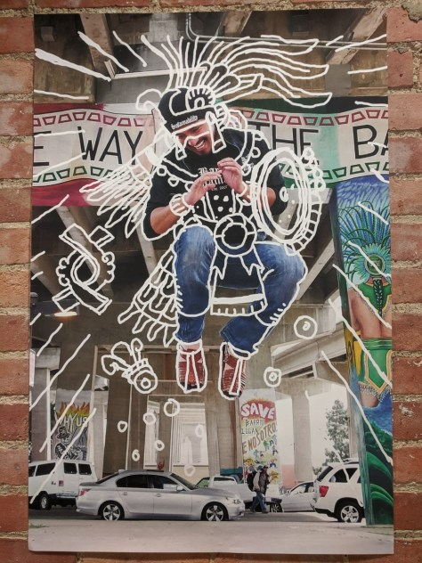

> **“None of us are well, until all of us are well.”** 

_José González returns to his alma mater, University of Michigan's School for the Environment and Sustainability (formerly School for Natural Resources and Environment) to speak on Wayfinding Cultural Connections: From Diversity, Equity, and Inclusion to Decolonizing.  
Photo credit: SEAS Office of DEI_

José González, award winning outdoor educator, Founder and Director of Latino Outdoors, and University of Michigan alum joins the It’s Hot in Here team this week to discuss his work with host Prachiti Dhamankar. Join us as José discusses underrepresentation in the outdoors, the Green 2.0 report, art, community, and identity. 

Latino Outdoors was founded in 2013 to address the lack of Latinx representation in the outdoor, conservation, and environmental education fields. Now, Latino Outdoors is a Latinx-led community and organization (in that order) that is focused on building family and celebrating culture and heritage in the outdoors. Latino Outdoors has grown to operate around the country and is open to all people who wish to celebrate diversity and inclusivity. Discussing his personal experiences growing up in México and the central valley of California, José shares his take on engaging with diverse audiences, access to natural spaces, and building senses of community and belonging. In exploring his own identities and experiences, José addresses the cultural gaps regarding the use of natural spaces. 

The ideas and mission of José and the Latino Outdoors team seem particularly salient in the wake of reports such as Green 2.0 which have pinpointed discrepancies of representation in the outdoors. Discussing the ideas laid out in this report, José eloquently navigates the concepts of unconscious bias, lackluster effort, and the Green Ceiling and how we might address them. 

José presents storytelling and art as means by which to connect to histories and cultures, celebrate diversity, and explore self-identities. As an accomplished artist himself, José examines his inspirations (from Frida Kahlo and Diego Rivera to modern comic illustrators like Paul Pope) and speaks about expression in a world of social media and trolls. In envisioning the future, José discusses how his ideas may be both radical and revolutionary, and how Latino Outdoors continues to build bridges, empower local leadership, and promote equal access. Finally, José discusses how we may lean into discomfort and grow via challenging conversations. 

- 
    
- 
    
- 
    
- 
    

_Examples of José González's artwork examining indigeneity , identity, and culture.  
Art credit: José González_

If you’d like to learn more or get involved with Latino Outdoors, see more of José González’s artwork and writings, or explore the Green 2.0 report, check out the links below!

[Latino Outdoors](https://latinooutdoors.org/)

[José González](http://www.josegagonzalez.com/)

[Green 2.0 Report](https://www.diversegreen.org/)
