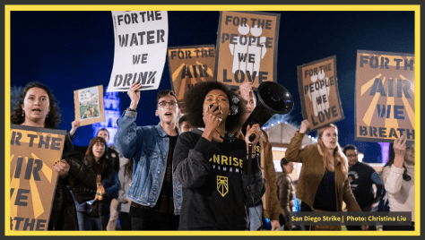

> **"The status quo has failed us."**

The [Sunrise Movemen](https://www.sunrisemovement.org/)t, founded in 2017, is a youth movement that grew out of the need to organize and mobilize young people around the country and promote political activism. The organization became well-known for staging protests and sit-ins in the offices of politicians around the nation, such as Speaker of the House Nancy Pelosi and Senator Dianne Feinstein. Now, Sunrise Movement has hundreds of autonomous “hubs” around the nation and hundreds of thousands of members. Sunrise Movement leaders Naina and Thalia sit down with us to discuss their experiences as young activists and leaders. 

As Naina points outs, the youth of America have had almost no hand in creating the systems that have led to global climate change, yet they will live with the consequences for their entire lives. Paying homage to civil protests of mass non-cooperation, the Sunrise Movement seeks to empower young people (many of whom cannot yet vote) through coalition building with frontline communities and their core strategies which include: peaceful protest, communities organizing, mass mobilization, and promoting political activism. The focus of the Sunrise Movement is to stop climate change, namely through the adoption of the Green New Deal. 

The [Green New Deal](https://www.sunrisemovement.org/green-new-deal), championed by politicians such as U.S. House Rep. Alexandra Ocasio-Cortez and Senator Bernie Sanders, is a proposed legislation package that would focus on moving America towards 100% renewable energy and net-zero carbon emissions over the next 10 years. It is also focused on creating millions of jobs in the clean energy sector and promoting climate justice. This would be the most ambitious legislative plan since FDR’s New Deal. Naina and Thalia touch on some criticisms of the plan and address both congressional parties’ unwillingness to act on climate change. The two also discuss how critical it is that bold, transformative action be taken.   

With the official endorsement of Senator Bernie Sanders for the 2020 Democratic candidacy, Sunrise Movement is now focusing on the upcoming presidential election and building a “coalition of the left.” A priority for them is making climate change action accessible to the non-scientific community via storytelling that personalizes issues of climate change. In order to get ordinary people to mobilize, the information has to be digestible. 

Naina and Thalia also speak to their experiences as young constituents and the ‘shocking’ treatment they have experienced on the part of their own representatives. Looking towards the 2020 election, there are several ways that you can participate in the Sunrise Movement. If you want to get involved, plan a launch party, find a hub near you, donate to the cause, or learn more information, head to their website. Also follow Sunrise Movement’s social media to learn about more opportunities. 

_**Sunrise Movement National:**_

_twitter_: [@sunrisemvmt](https://twitter.com/sunrisemvmt)

_insta_: [@sunrisemvmt](https://www.instagram.com/sunrisemvmt/)

_facebook_: [@sunrisemvmt](https://www.facebook.com/sunrisemvmt/)

_**Sunrise Movement Ann Arbor Hub:**_

_twitter_: [@sunriseannarbor](https://twitter.com/sunriseannarbor)

_insta_: [@sunriseannarbor](https://www.instagram.com/sunriseannarbor/)

_facebook_: [@sunrisemvmtannarbor](https://www.facebook.com/SunriseMvmtAnnArbor/)
