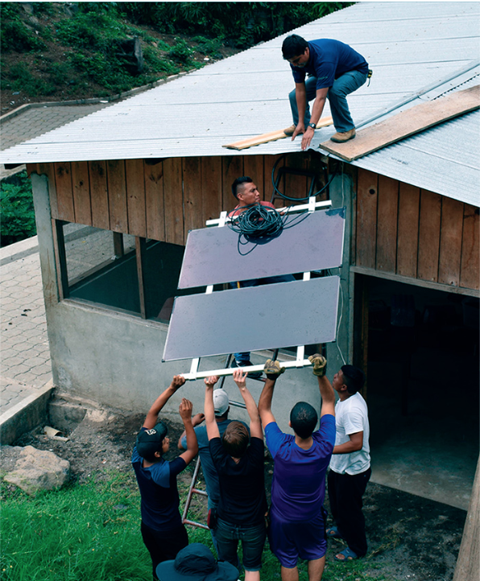

Ever heard of the triple bottom line: people, profits, and planet? Ever wondered what a business model that priorities all three would look like, if it’s even possible? Look no further than Appropriate Technology Collaborative and the future of equitable, sustainable development. John Barrie, a “recovering architect” and co-founder of [Appropriate Technology Collaborative](https://www.apptechdesign.org/about-atc-2) (ATC), and Monika Goforth, co-founder and executive director of ATC, join us once again in the It’s Hot in Here studio to talk about the future of solar energy and bottom-up, women-led business models. 

Founded in 2008, ATC, as the name suggests, is a collaborative geared towards creating “opportunity by design.” Now, ATC is an award-winning, globally-recognized organization working out of the U.S. and Guatemala. Shedding the skin of traditional “charity-minded” organization, ATC follows a social business model founded in equity, community engagement and leadership, and “radical transparency” on all fronts. 

<figure>

<figcaption>

Members of ATC install rooftop solar panels in Guatemala.  
_Photo Credit: Appropriate Technology Collaborative_

</figcaption>

</figure>

ATC defines “appropriate technologies” as simple technologies that greatly improve the quality of life for low income people using widely available resources that are affordable and accessible to anyone. This includes a variety of different products, such as solar-powered water pumps and food dehydrators. ATC also is focused on providing practical, direct training (e.g. financial management, technical skills, sustainable business management, etc.) for individuals in Guatemala to learn how to grow their own businesses and utilize new technologies.

> _“Our purpose is to design, develop, demonstrate and distribute appropriate technological solutions for meeting the basic human needs of low income people worldwide.”_ 
> 
> \- Appropriate Technology Collaborative Mission Statement 

John and Monika go on to discuss the ways in which they have structured ATC to prioritize gender and racial equality within the collaborative, how technological collaboratives work, as well as some personal stories about their experiences. With the [Mayan Power](https://www.apptechdesign.org/mayan-power-and-light-3) project and, more recently, the [Detroit Solar](https://www.apptechdesign.org/detroit-solar) project, the two co-founders of ATC have seen their ultimate goal realized which is local people having the resources and the investment to become self-sustaining and solve local problems. 

Join us in the studio as John and Monika talk the future of sustainable technology applications, specifics about their business model, ongoing projects, and how they measure success. Want to get involved? Check out ATC’s careers and [volunteer opportunities](https://www.apptechdesign.org/volunteer-2) or check out ATC’s [humanitarian carbon credit program](https://www.globalgiving.org/projects/carbon-credits/?rf=ggWidget). This allows individuals to subsidize personal carbon emissions (i.e. from commuting, flights, etc.) by donating money that directly funds a solar grid for a family in Guatemala.
