###### One time, at a party in Ann Arbor...

Fela Kuti's tune _[Let's Start](http://www.youtube.com/watch?v=0zWRjgathjA)_ began to play on [88.3 WCBN | FM | Ann Arbor.](http://www.wcbn.org/)  Unbeknownst to everyone, It's Hot in Here was born. It celebrates the wealth of knowledge at the University of Michigan's School of Natural Resources and Environment (SNRE), now known as the [School for Environment and Sustainability (SEAS).](http://www.seas.umich.edu)

Putting that knowledge in conversation with practice in Detroit, Ann Arbor and the World, It's Hot in Here ushered in a new era in eco-optimistic college talk radio, with local and global music to boot.

Ten years and over two hundred live shows later, a seed that started off as a joke at that party has grown - _and is still growing_ - into a family of friends, research specialists, activists, policy makers, artists, journalists and more.

Remember an episode from long ago? Check out our archives. Have a story to tell?  Join us.

# Currently On-Air

## Pendle Marshall-Hallmark:  Producer, Researcher and Host

[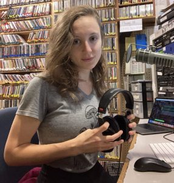](https://hotinhere.us/wp-content/uploads/2023/11/IMG_9269-scaled-e1699554887678.jpeg)Pendle Marshall-Hallmark is earning her master’s degree at U-M’s School for Environment and Sustainability after nearly a decade working in social, economic, and environmental justice advocacy. Among other experiences, she has worked in refugee resettlement as an Americorps VISTA Fellow, studied social entrepreneurship in Mexico as a Fulbright Scholar, accompanied threatened human rights activists in conflict zones in Colombia, and organized oil and gas divestment campaigns with an organization dedicated to defending Indigenous territories in the Amazon rainforest.

Pendle’s time as a human rights accompanier in Colombia was particularly impactful. They reflect, “All of the communities and activists I accompanied had lost loved ones to paramilitary and state violence related to land and resource control; I realized that there is an inextricable link between racist, neocolonial patterns of exploitation and the climate crisis.” Now, Pendle is pursuing a deeper theoretical and historical understanding of the environmental justice movement as a graduate student at SEAS, with a continued commitment to putting theory into practice and foregrounding the voices of frontline communities. As host, she aims to dismantle the white supremacist cis hetero capitalist patriarchy by sharing the stories of those it invisibilizes. 

# On Air Here and There

## Meg Czerwinski: Engineer, Host, UM Nursing Student (est: 2015)

Meg holds a PhD  from the University of Michigan's Nursing School, and did undergraduate work in Art and Design at UM. She completed postdoctoral work in curricular innovation with the online platform [www.learngala.com](http://www.learngala.com) at UMSEAS, while teaching a course called "Frontiers[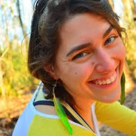](https://hotinhere.us/wp-content/uploads/2020/10/download-2.jpg) in Environmental Justice" in our school's Environmental Justice Specialization field, and is now working as a nurse in the University of Michigan health system, to get some grounded experience in medical care provision. Meg's talents for sound engineering, health related research, and convening conversations that link to community facing educational and outreach tools are unparalleled and our platform would be impoverished without her.

Jim “Tex” Manheim: Engineering Staff (Est. 1990)

Tex was first exposed to classical music in his Toledo, Ohio, family home, where reigned the belief that the family that plays recorders together, stays together. He went on to sing in a really good high school choir that performed Mozart's "Coronation" mass, but he always had the most enthusiasm for the earlier eras of the classical tradition. So he took a lot of music history classes and ended up with a history and theory music degree from Amherst College -- one of the few such undergraduate degrees offered in the U.S. He did a written honors thesis entitled _The Point of Counterpoint in Mozart's Piano Sonatas._In Ann Arbor, MI, Tex studied music some more at the University of Michigan and worked for various publications, including the _Ann Arbor Observer._ Somewhere along the way he stopped being an academic and started being a writer. He joined AMG the day the company opened its doors in Ann Arbor, February 8, 1999.

Tex continues to enjoy reviewing album releases from the sphere of what's known as "early music" -- a rather broad category covering music written between about 400 and 1750. In his spare time he hosts a historical and eclectic co[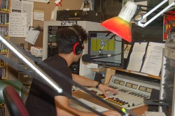](http://www.hotinhere.us/wp-content/uploads/2015/10/1600156.jpg)untry music radio program on WCBN-FM, Ann Arbor (try wcbn.org from noon to 3 Eastern time on Saturdays) and is usually found hanging out in a concert space or restaurant somewhere. Tex recently celebrated his 25th anniversary on WCBN, sharing the country and bluegrass shows on Saturdays! Off the air, he is a writer. Tex proclaims that "Although I'll write anything if you offer to pay me, a day on which I get paid to write about music is a good day!" Tex has been to Indonesia three times and is thinking about moving there even with all its ecological problems -- Tex says that he gains new perspectives on those almost every time he engineers for _It's Hot In Here!_

## Ed Waisanen: Host, Producer, UMSEAS(est. 2015)

Ed was born and raised in Ann Arbor and returned home after a long absence for a Master’s degree at SNRE (now SEAS). He started work on multimedia projects for [Michigan Sustainability Cases](http://learngala.com) which morphed into the open source, open access platfrom www.learngala.com for which he is now platform and program manager. Ed has trained or supported the rest of the Hot in Here crew as an occasional co-host, organizer, and font of unsolicited show ideas. He’s also been known to produce a podcast or two.

## Rebecca Hardin: Faculty Ally (est. 2008)

Rebecca Hardin, Associate Professor at UMSEAS has been a regular "pinch hitter" in the studio. Rebecca has loved learning about the broadcast process and contributing to one of the hippest, coolest, MOST independent radio communities on the planet. She loves convening conversations in the grungy underground studios of WCBN FM Ann Arbor, under the oh-so-maize-and-blue first floor of the Student Activities Building.  Some of her favorite hours from the archive include:

- [House-Greening with Mat Grokoff and Joe Trumpey](http://hughstimson.org/2012/02/06/house-greening/) (two totally different and dynamite models for rethinking residential environmentalism, a good excuse to play "Brick House" on air).
- [Environment, Information, and Development on the African Continent](http://hughstimson.org/2011/11/10/environment-information-and-sustainable-development-the-africa-asia-nexus/) with Bilal Butt, Omolade Adunbi, and Joyojeet Pal (talking about the Africa/Asia nexus bak when they were all brand new faculty at UM)
- A special [holiday episode on consumption](http://hughstimson.org/2011/12/19/consumption-hoarding-tight-wad-show/) with Ross marketing Professor Scott Rick and Psychology Professor Stephanie Preston (with a soundtrack, you might predict, ranging from Madonna to Erykah Badu)
- And who can forget her [debut in that hot room](http://hughstimson.org/2008/04/22/africa-earthday-edition/) (with the requisite hazing from former-WCBN Program Director Kristin Sumrall, in the form of random vinyl snippets for a live reaction)?

## Isabelle Brogna, Host, Producer, UM Civil and Environmental Engineering student (2019-2020)

Isabelle is a 2020 graduate from the University of Michigan with an MS in Mechanical Engineering and a Certificate in Science, Technology, and Public Policy. After graduating from Duke University with a BS and departmental [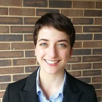](https://hotinhere.us/wp-content/uploads/2020/10/0.jpg)distinction in Mechanical Engineering, Isabelle worked as an engineer in the power services group of MPR Associates Inc. After leaving UM she has been a public policy intern in General Motors' Regulatory team, where seh researches electric vehicle (EV) state fleet mandates and assesses opportunities for policy action. Investigate residential charging access for EVs nationwide and identify knowledge gaps in research and implications for existing assumptions. We miss you Isabelle!

## Prachiti Dhamankar: Host, Producer, UMSEAS (2019-2020) [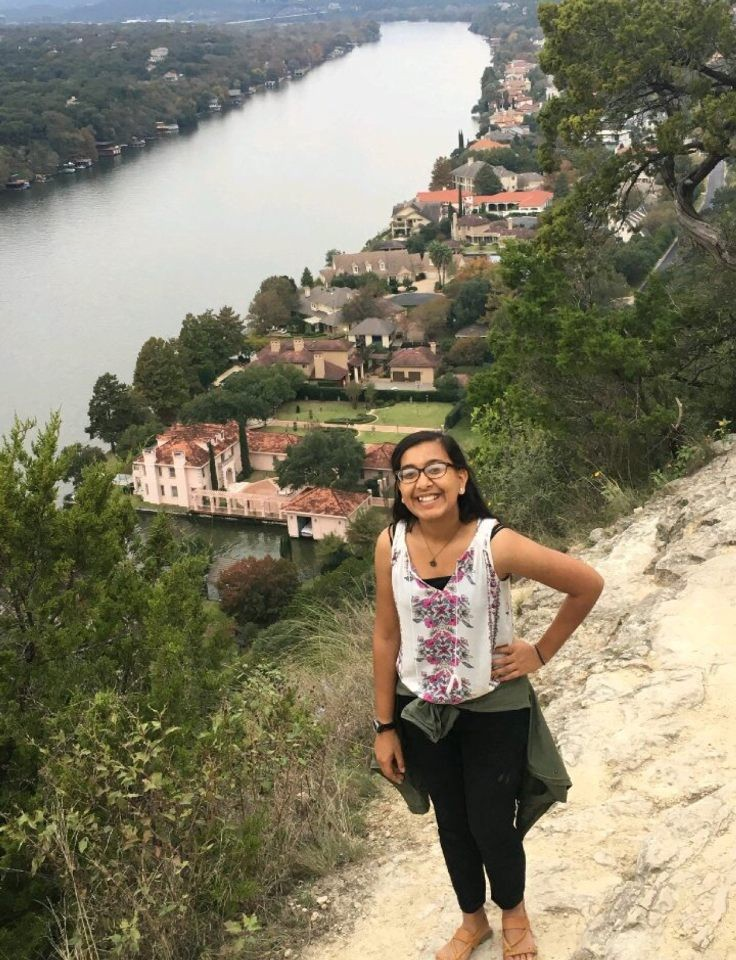](https://hotinhere.us/wp-content/uploads/2020/09/IMG1727116042289838511.jpg)

Prachiti Dhamankar\*\* is pursuing her MS at the School for Environment and Sustainability (SEAS) with a concentration in Sustainable Systems. She dealt with the enormous volumes of waste generated and diverted from landfill firsthand in the most labor-intensive job she has ever had while working at a minority-women owned and operated recycling & composting center in Dallas-Fort Worth during her gap year. She hopes to use her degree to better manage and reduce the impact of solid waste flows. Raised in a small town in Southeast Texas (shoutout to 409!), Prachiti is ecstatic to have found her way all the way in Ann Arbor – that too in a studio! She has thoroughly enjoyed interacting with the IHIH family and co-hosting some rad shows with Isabelle leading up to the COVID-19 pandemic. It was especially memorable when she held a **live** sea lamprey **in her hand** during the GLFC episode. When she isn't lamenting at the amount of waste generated, Prachiti is always in the mood to talk to her sister, do a jigsaw puzzle, or cook a spicy new recipe. \*\*\[Pronounced pruh-chi-tee where the “t” sound is the same as in thesis or thoughts and last name is dhah-mun-kurr. =) \]

## Bella Isaacs-Thomas: Host, Producer, PitE Student (2019)

Bella is a graduate of the University of Michigan's Residential College where she studied creative writing, social theory and practice, and environmental science. [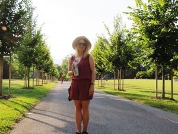](http://www.hotinhere.us/wp-content/uploads/2018/11/D4127C2B-9CE5-4059-B611-5548BE279DF5.jpg)She spent a summer researching freshwater ecology at the Biological Station in Northern Michigan and wrote her senior thesis on ecofeminism and the intersection of health and environmental quality. In addition to being on the Hot In Here team, she interned at Michigan Radio's _Stateside._ She is now living the dream, working for PBS News Hour in Washington DC and nurturing her career in environmental journalism.

## Aurora Aparicio: Host, Producer, UMSEAS Student (est 2019)

After traveling over 1,000 miles, Aurora came to the University of [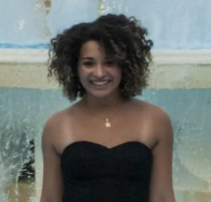](http://www.hotinhere.us/wp-content/uploads/2018/11/IHIH-Bio-Pic.png)Michigan as an ambitious first-year Master’s candidate studying Behavior, Education, and Communication at SEAS. En route to class, she tends to fill her ears with stand-up comedy recordings, true crime podcasts, and Radiohead albums. Aurora has developed a recent fascination with photorealistic sketching, a talent she knows she simply does not have the time to foster but will convince herself otherwise. She is especially grateful for her friends, her dog, and the IHIH radio show & crew as they are helping her to find her radio voice and cultivate skills for her future career as an environmental science communicator. Catch her _Word of the Week_ segment every Friday between 12 and 1 on 88.3 FM Ann Arbor.

## Logan Christian: Host, Producer, UMSEAS Student (est 2018)

Logan Christian was a Master's student in the School for Environment[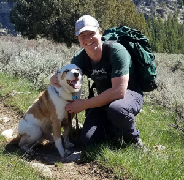](http://www.hotinhere.us/wp-content/uploads/2018/11/image.png) and Sustainability pursuing the Environmental Policy and Planning and Behavior, Education, and Communication tracks. He recently moved here from Utah where he worked on several environmental initiatives including organizing a farmers market, lobbying for climate change policy, and organizing environmental education events for kids. He is currently helping out with the radio show by conducting interviews and going on air with his fellow co-anchors as much as possible.

## Heena Singh: Host, Undergrad, DJ Heenz, UM Mechanical Engineering Student (2015)

Heena was a senior undergraduate mechanical engineering student that discovered WCBN her sophomore year! She immediately trained to become a student DJ and now has a weekly show Premenstrual Swing every Friday 4-5 PM where she plays everything from deep soul to classical to Swedish pop and bhangra!

She has always had a passion for learning about environmental issues in her community. At her time at the University, she has been a Planet Blue Student Leader and member of the professional environmental fraternity Epsilon Eta. Within engineering, she has focused her project work on renewable energy and electric mobility. She is currently on a multidisciplinary design team working on developing lightweight solar tracking cells that use principles of Kirigami (Japanese paper cutting) to rotate cells.

[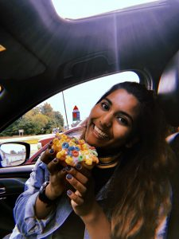](http://www.hotinhere.us/wp-content/uploads/2018/11/image1.jpeg)Heena also has tons of international experience! She has worked at a nuclear engineering research institute in Shanghai, China, a wood gasification system in Berlin, Germany, and an EV battery swap startup in Bangalore, India. This past summer, she started an environmental podcast where she interviewed people all over the world about the ways in which they connect with their environment in the realm of music, arts, technology, science, and policy. Check it out now on [Spotify](https://open.spotify.com/show/2Wvcv9apWZWOdE0KtmJg1g?si=roVTRcnUST66mtPbXd-pfQ) and [iTunes!](https://itunes.apple.com/us/podcast/happy-earth-day/id1434988442?mt=2)

# Leana Hosea: Coach, Mentor, Wallace House Journalist (2018)

Once upon a time, we were lucky to have radio and digital med[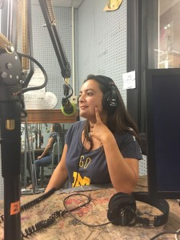](http://www.hotinhere.us/wp-content/uploads/2015/10/IMG_4125.jpg)ia journalist Leana Hosea of the BBC (check out her reportage on rhino poaching [here)](https://www.youtube.com/watch?v=VJvlsr4jiL0). During her time as a Knight Wallace Fellow, Leana worked to document and analyze water crises unfolding in different sites within the U.S. including Flint, Michigan, and Navajo territories. Check our her film [Thirst for Justice.](https://www.thirstforjustice.org/) She also offered us training resources, constructive critique of our live broadcasts and podcasts, as well as convivial time on the mic and in studio. Leana's subsequently returned to the BBC, then left again to found her own non profit for hard hitting investigative journalism about water quality issues around the world: [Watershed.](https://podcastaddict.com/podcast/the-watershed-investigations/4545350) We love you, Leana!

## Ben Sonnega: Host, Producer, Engineer, PiTE student (2017-2018)

Ben is a graduate of University of Michigan where he studied Program in the Environment with a minor is Energy, Science, and Policy. As a for[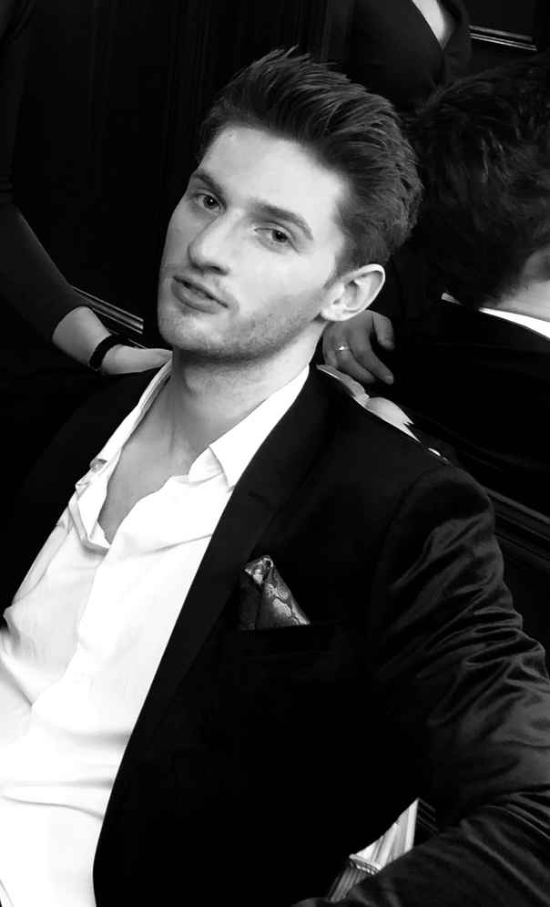](http://www.hotinhere.us/podcast/energy-and-environmental-policy-research-a-student-symposium/)mer [guest](http://www.hotinhere.us/podcast/energy-and-environmental-policy-research-a-student-symposium/) on the show, he decided he hadn't had enough. Intent on bringing new voices and opinions into the ever-growing climate dialogue, he can be found most often clutching a cup of coffee and striking up conversation with a stranger. Outside of the confines of the WCBN studios, he is a musician, writer, and a former varsity mens rower at U of M. He also serves on the digital media team for [Michigan Sustainability Cases](https://www.learngala.com/).   Check out one of his favorite shows [here](http://www.hotinhere.us/podcast/cop-23-a-conversation-on-bonn-climate-negotiations-2017/)!

## Chris Askew-Merwin: Host, Writer, SEAS Student (2016)

From early childhood in Tanzania to being a teenager right here in A2, Chris has lived across cultures, disciplines, and models for engagement to create positive social and environmental change.  On air during Fall 2016, Chris also drew his classmates at SNRE (now SEAS) into IHIH, and[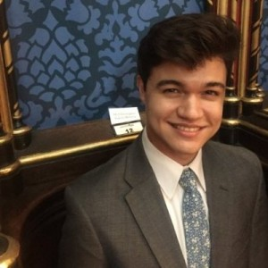](http://www.hotinhere.us/wp-content/uploads/2015/10/AAEAAQAAAAAAAANlAAAAJDZkYmM1NzlhLWE2NmQtNDMxOS04YzcxLTQ4YzkyYjkyMWY1NA.jpg) made us a stronger team. Having graduated from the UM Program in the Environment, and worked last summer on a coalition of Michigan universities coordinating responses to the Flint water crisis. He also enrolled in the Environmental Justice track at SNRE (now SEAS) for a Masters Degree. Chris's first show, [The Oregon Trial,](http://www.hotinhere.us/podcast/the-oregon-trial/) was recorded the week that the trial began for those involved in the armed standoff at a wildlife reserve in Oregon. His music shows are great too. Search the archive for Chris's smooth touch and listen on!

## Malavika Sahai Host and Social Media Manager (2016)

Malavika's radio debut was in Blacksburg, Virginia, as a student at Virginia Tech. There she founded and regularly broadcast a show called "Pop of Thought" that featured critical reconsiderations of mainstream media from the vantage point of various identity groups who don't qualify as "dominant" in U.S. popular culture.

As a student in the Environmental Justice track at SNRE (now SEAS), Malavika kept us current on social media and slid on-and-off mic with the ease of an experienced radio personality. We loved her first time on the mic with [Appropriate Tech Collaborative](http://www.hotinhere.us/podcast/mayan-power-light/). Check out Malavika's previous radio work [here](https://soundcloud.com/malavika-sahai).

## Michael Burbidge: Producer, Host, UMSEAS Student (2015)

Mike is a human, much like those reading this text. More specifically he is a long, tall, Texan with a variety of income generating and leisure experiences.  He prefers exchanges through voice over other communication avenues. Postcards are a close second. Mike served as a Peace Corps Volunteer in Cameroon ('11-'13) before returning to the U.S. to earn his Masters Degree from SNRE (now SEAS). He conducts research on human/animal interactions and landscape management in sites in Gabon, in Kenya, and even Oregon.

[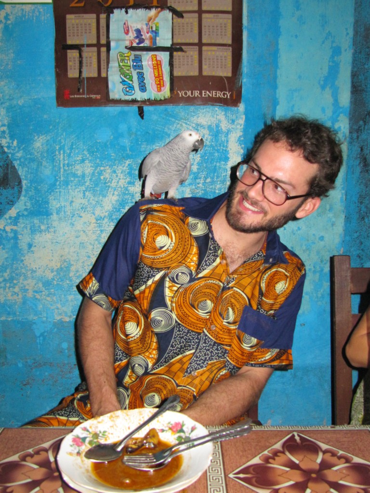](http://www.hotinhere.us/wp-content/uploads/2015/10/IMG_3222-e1476293627332.jpg) Mike will eat pretty much anything because he cannot grapple with starvation and massive food waste coexisting in similar landscapes. Storytelling, resource sharing, and community growth are pique pillars of his life.  Check out his shows on the [militarization of conservation in Africa,](http://www.hotinhere.us/podcast/militarization-of-conservation-narratives-of-poaching/)  [lasting conservation strategies](http://www.hotinhere.us/podcast/last-animals-lasting-solutions-lions-the-last-animals-and-conservation-strategies/), and [B-school student engagement in D-town.](http://www.hotinhere.us/podcast/impact-detroit-72-hours-and-80-humans/)

## Dania Gutierrez: UMSEAS student and Co-Host (2014–2015)

[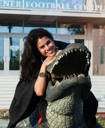](http://www.hotinhere.us/wp-content/uploads/2015/10/2709344.jpg)When Dania first came to Ann Arbor, it was such a wonderful surprise to find a student-run radio show focused on the environment and all about conversing with community members. There is incredible value in simply getting others to share their experiences and passions as a form of learning. She could not pass up an opportunity to learn how to use a new form of communication as a way of engaging students and community members. She's thrilled to have joined the IHIH family and spent her last year at U-M sharing and learning on the radio!

Harry Rice:  PitE student, founding producer of "It's Hot out There" (2015)

Harry comes from a very rural town in Pennsylvania that has a large Amish population; in fact, Lancaster county, where he lives, is often referred to as "Amish Country." Being surrounded by agriculture helped him understand the beauty of nature (except for the awful smell of manure) and the importance of food in our world. These are the reasons he jo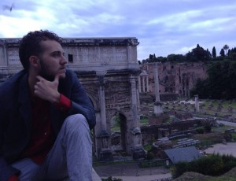ined It's Hot in Here; everyone needs to understand nature's importance in order to stop the destruction of our planet, and the case studies of this show do a great job in illustrating those.

Apart from being involved in the show, he was also a part of a student organization that raised money for need-based student scholarships, Appreciate + Reciprocate, and another group that used nature to give families at Mott's Children's Hospital a way to ease their minds, Wild About Nature. He is also a huge advocate for study abroad programs, as he spent Winter 2014 in Rome, Italy. The picture above was actually taken during a sunrise over the Roman Forum--Harry now travels a LOT in his work for the State Department, based in Washington DC. His favorite hobby remains photography, and several IHIH posters have used his images!

## Bailey Schneider: Host, Media Manager, PitE student (2015)

Bailey joined our team as an LSA student aspiring to obtain either a Ph.D or an M.D, (or both). She had particular interests in sustainable agriculture, food science and environmental policy, having grown up in the beautiful Sonoran desert in Scottsdale, Arizona before her father (rest in peace) moved her to the island of Kaua'i, Hawai'i for high school. Bailey was raised by a very environmentally and socially conscious retired doctor so she has an extensive background in activism, environmental and social justice, and environmental radio talk shows. Throughout high school, Bailey participated in the Kaua'i Has The Right to Know movement and Bill 2491 activism against GMO and Agrochemical companies. She also worked at Metamorphose Yoga Studio in Kilauea, Hawai'i.  Outside of _It's Hot in Here_, she was involved in several organizations at the University of Michigan, including the Beta Delta chapter of Kappa Kappa Gamma sorority, Kids Without Cancer, and Maize Rage. She is a Michigan legacy so she was born wearing Maize and Blue and singing the fight song. Bailey is now finishing medical school in Queensland, Australia.

Rebecca Baylor: Co-Host, UMSEAS student (2014)

[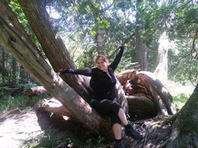](http://www.hotinhere.us/wp-content/uploads/2015/10/6749809.jpg)Have you ever been overwhelmed with passion and positive energy during a seemingly simple conversation? Well, Rebecca was inspired to take part in the IHIH show because every interview, on-air phone call, and member of the IHIH family ignited those feelings of excitement in her. It's a spark of enthusiasm that is difficult to explain but one that carries her commitment to various environmental causes forward. IHIH recognizes that people are involved in every environmental problem or opportunity. Without consideration of peoples' thoughts and actions we are not fully addressing ecological issues. Away from the mic, she is passionate about uniting interests of sustainable food entrepreneurship. Her background in ecological psychology (B.S.) and communications strategy (B.A.) helped frame her view of these issues. At the University of Michigan, she studied how local communities and scientific information inform policy and personal practices around food. She was involved in the UM Sustainable Food Program and UMBees too! Now, she works with the Davidson Institute doing assessments of interventions at home and abroad.

Cameron Bothner: Engineer and Wizard (2014-2018)

Cameron is Ann Arbor raised (if not born), and studied Linguistics, Computer Science, and Japanese at the [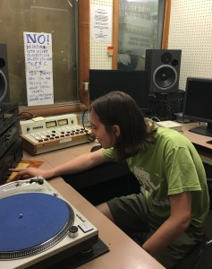](http://www.hotinhere.us/wp-content/uploads/2015/10/IMG_3747.jpg)University of Michigan. He headed development at WCBN-FM, and his freeform program, Ceci n'est pas freeform, was Mondays from 5:00PM to 6:00PM. A talented audio engineer, Cameron helped to keep our shows sounding great. He is also a talented software engineer who built new engaged learning platforms for sustainability science through the [Michigan Sustainability Cases.](https://www.learngala.com/catalog/libraries/michigan)Cameron is a DJ and self-proclaimed musician, artist, writer, attentive audience, explorer, and thinker. He now lives in Montreal, coding for Shopify!

## Arman Golrokhian: Producer, Host, UMSEAS student (2014-16)

Arman Golrokhian was a dual degree MS/MPP candidate at the University of Michigan studying Public Policy at the Ford School and Sustainable Systems at SEAS. With a background in mechanical engineering, he seeks interdisciplinary solutions to sustainability challenges. He sees research, creative b[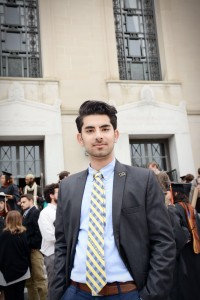](http://www.hotinhere.us/wp-content/uploads/2015/10/2016-05-01-00.24.43.jpg)usiness models, smart policies, and effective communication as the critical building blocks for unlocking potential solutions to sustainability challenges. He is interested in interdisciplinary research and engaging wide range of stakeholders through various means of communication and multimedia. Right now he is pushing the envelope with [audio components to our Michigan Sustainability Cases](http://www.hotinhere.us/podcast/baltimore-an-msc-podcase-conversation/), and starting a job at DTE in Ann Arbor.

Arman has been engaged with the United Nations Climate Change negotiations and coordinated the University of Michigan’s delegation attending the Conference of Parties in Lima, Peru in December 2014. He also took the Fall 2015 semester off to serve as the Youth Co-coordinator for the UN Sustainable Development Education Caucus during the climate negotiations in Paris.

Arman joined the IHIH family from Iran, where he was born and raised. In his free time, he loves traveling and learning about people and cultures. He also takes IHIH team members with him to cultural shows, festivals, and other venues where we can learn about Iran, reminding us that even though we started at "a party in Ann Arbor" we will grow best if we are a moveable feast.

## Jennifer Lee Johnson: Co-Founder, Host, Producer  (2008-infamy)

Long before Jennifer had a concept of time, she was tuning into solid records and stories from her dad's pirate radio-ed youth in Poland, Ohio. Much later in 2008, as she began transitioning from a M.S. to a Ph.D. student at SNRE in Ann Arbor (now SEAS),  this (likely) latent dream of hers - of making her own radio memories - came true. She is proud to have worked with everyone who's been a part of the It's Hot in Here family.  We started out silly and strong with our first pseudonyms (de[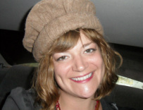](http://www.hotinhere.us/wp-content/uploads/2015/10/1395943621.jpg)rived from imaginary ancestors and the NPR name generator) and our first print feature with his Holiness, the Dali Lama (in SNRE Steward's Magazine).  Today, the shown has grown into something we never could have anticipated.

Jennifer studied fish, people, and ideas about fish and people in and around Nyanja Nalubaale (Lake Victoria, Uganda) where she conducted fieldwork since 2007. Her dissertation focused on women’s vernacular work in Uganda's fisheries to provide fresh perspectives and theoretical insights on this Great African Lake. She has worked professionally on fisheries issues for the Marine Fish Conservation Network, the National Oceanic and Atmospheric Administration’s Great Lakes Environmental Research Laboratory, and the Blue Ocean Institute, and holds a Ph.D.  as well as an M.S. in Environmental Policy and Planning from the same school. She earned a B.A. in International Political Economy from the Colorado College. When she's not nerding out, or eating fish on an island in Lake Victoria, there are few places she'd rather be than [WCBN-FM Radio Free Ann Arbor.](http://www.wcbn.org/) Now, she's [Assistant Professor of Anthropology at Purdue University in West Lafayette, Indiana.](https://www.cla.purdue.edu/facultystaff/profiles/new/newfaculty-15/Johnson._JenniferLee.html)

## Sam Molnar: Co-Host (2014)

[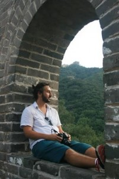](http://www.hotinhere.us/wp-content/uploads/2015/10/5309499.jpg)A graduate of the Environmental Informatics program at the School of Natural Resources and Environment (now SEAS), before returning to school, Sam was a school-based community organizer in the Detroit school system. In those years, he honed a keen interest in justice making that he says doesn't think he'll "ever shake." Enter stage left: the big microphone that is the radio. "I'm a believer in the ability of small conversations to produce big change, and what better way to do that than to broadcast them? Some of my favorite memories of my childhood include the smell of biscuits lingering with the sounds of public radio in my grandma's home and stealing away to listen to the bold humor on The Howard Stern Show (but I promise to never go there on IHIH)," Sam said. Sam also worked in the Detroit area as a Business Development Specialist at Health Insurance Services and as an activist on water and community rights in that city. But with any down time he is likely to be cooking up a storm in his kitchen or hiking through some quiet woods.

## Gus Turner: Engineer (2013–2014)

Gus worked with WCBN for more than two years both as an audio engineer and a radio host for freeform music shows.  His final semester, he devoted the majority of his time with the station to working on "It's Hot In Here," a position that was passed down to him by the show's former engineer, Paul Stromberg. During his time with IHIH, he learned more about the environment from Jennifer, Andrea, and Rebecca than the public education system was ever able to teach him. And what's more, they were fun and hilarious teachers all the way through.

[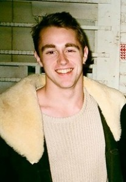](http://www.hotinhere.us/wp-content/uploads/2015/10/801201.jpg)Aside from WCBN, his interests include writing, writing, and writing. Also, writing. He was Managing Editor for Content Strategy at COMPLEX Media, providing coverage and commentary in areas including music, tech, sports, and video games. In May 2014, he graduated from the University of Michigan with a B.A. in English Language & Literature and moved to New York. The city has many amazing things,  but he doubts that it'll ever be able to find him a suitable replacement for IHIH. Truly, working with "It's Hot In Here" is a privilege, and it's one that he hopes many others after him will be able to enjoy.

Pearl Zhu Zeng: Producer, Host, UMSEAS student and Web Designer (2014)

Pearl Zeng was a graduate student in the UMSEAS Behavior, Education & Communication program. Subsequently, she worked as the Learning Platform and Web Manager for a curricular innovation project _Michigan Sustainability Cases,_ where she also honed her developer skills. She is now lead developer at Sift, in Detroit.

She notes: "Interactive radio shows have always been fascinating to me and carries a history with me. During my undergraduate program in China, I worked as a campus radio host where I presented a bi-weekly program that interviewed people and organizations that were in the public spotlight. It was so exciting to help honored guests share their unique stories! Now with the IHIH family, the interactions with our guests and the positive dynamic between co-hosts and DJs make it an incredible atmosphere to be a part of. Receiving responses from the listeners also brought a great pleasure and made me fall in love with the show even more."

## Andrea Kraus: Producer and Co-Host (2013)

[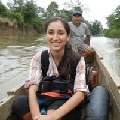](http://www.hotinhere.us/wp-content/uploads/2015/10/2869241.jpg)Thanks to a geographically-unusual childhood, Andrea was raised by fantastic storytellers from both the Texas-Mexico border and small-town Bavaria. Their diverse stories taught her early on how much people across the world have in common, and how powerfully the spoken word highlights our shared humanity. Given the divisive nature of the conversation around climate change, it's more important than ever to promote inclusive dialogue that extends a mic to people from all walks of life. Andrea joined It's Hot In Here because it provides an amazing grassroots platform for just that sort of positive, unifying exchange. When she wasn't in the WCBN studio, she earned a dual MBA/MS at Ross and the School of Natural Resources and Environment (now SEAS). In years past, she was a Peace Corps volunteer in Panama, worked on a global CRM team for Siemens in Munich, interned at StoryCorps in Brooklyn, and earned a BBA/BA in International Business and Anthropology from the University of Texas at Austin. She now works for an energy utility in northern California.

## Paul Stromberg: Engineer (2013)

[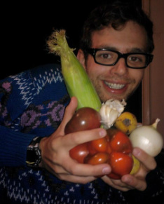](http://www.hotinhere.us/wp-content/uploads/2015/10/1395943840.jpg)Paul was with WCBN for two years and managed to work on many cool projects while there. Of all those projects, engineering sound for It's Hot in Here was the most interesting. During his short time with IHIH, he learned more about the environment and radio than he ever did in his previous two years at the station. Listen and we can all learn together!

## Kat Superfisky: Host, Producer, UMSEAS Landscape Architecture Student (2011-2013)

[Kat Superfisky](http://katsuperfisky.com/), aside from being an institution within an institution at SNRE (now SEAS), is one of the most talented free form radio DJs this town has ever known. Alas, she is now in Los Angeles, where she notes that the wealth of things to do and the dearth of dolla dolla bills y’all is perplexing to her, but never dull (e.g., [she's teaching](https://www.uclaextension.edu/pages/InstructorBio.aspx?instid=30860) a course on General Botany for Gardeners for the UCLA Extension). Runner, landscape architect, rasta girl, Kanye fan (oh, Kat, you never gave Dilla a chance) - Kat lives on in the WCBN studio lore, and in our Hot-in-Here hearts.

Shannon Brines: Engineer and Voice from the Booth (2009-2012)

A lecturer, farmer, research support staff and manager of the Environmental Spatial Analysis Laboratory at the School for Environment and Sustainability (now SEAS), Shannon Brines was tapped to help host and engineer It’s Hot In Here toward the end of the Hugh Stimson-era.  Shannon is a true local, having grown up in Dexter, Michigan before working for and attending the university.  He has an 80-acre farm in north-central Washtenaw County and is very active in the local food system.  It should not surprise you that Shannon's favorite It's Hot In Here episodes are the ones that feature anything to do with food, sustainable design, and environmental informatics.

## Laura (Smith) Cole: Host, Producer (2011–2012)

[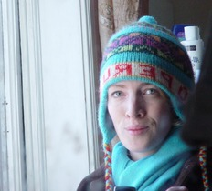](http://www.hotinhere.us/wp-content/uploads/2015/10/2763905.jpg)During the penultimate year of her Ph.D., Laura co-hosted IHIH in 2011-12 while "Gina" was on research leave. While at Michigan, Laura completed her doctoral work across Architecture and the School of Natural Resources (now SEAS). She then moved on from writing her dissertation in a dark, windowless basement to a position with the University of North Carolina at Greensboro, where enjoyed teaching, continuing her research, and (gasp) a fabulous office with windows. But her conversations about the environment have never been so spunky before or since her time at IHIH! Laura's favorite IHIH episodes were the [Bird Geek Show](http://hughstimson.org/2012/04/16/bird-geek-show/), where random people kept enthusiastically calling the sound booth during the hour, and the show on the [Localization Reader](http://hughstimson.org/2012/02/20/the-localization-reader-adapting-to-the-coming-downshift/), where she had the honor of conducting a 1-hour interview with her mentor, [Raymond De Young](http://www.snre.umich.edu/profile/rdeyoung). Laura recently moved to University of Missouri, returning to the "Great Mid" for her career in teaching and research!

## Rachel Chadderdon-Bair: Host and Producer (2011-14)

[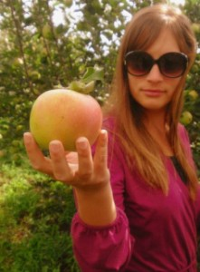](http://www.hotinhere.us/wp-content/uploads/2015/10/1395943730.jpg)Rachel Chadderdon-Bair came to It’s Hot in Here with an interest in pubic dialogue on environmental issues, and a deep love of music born in part through her own musical career with the band Hullaballoo, and writing and performing her own songs. In her post graduate [day job](http://www.fairfoodnetwork.org/our-story/leadership/rachel-chadderdon-bair), she directed the Double Up Food Bucks (DUFB) program for the Fair Food Network. She worked with market managers, farmers, and community partners to implement the program and bring new customers to participating farmers’ markets. In 2008, she managed the Downtown Ypsilanti Farmers Market, the third market in Michigan to begin accepting electronic SNAP benefits. Rachel is a native of Kalamazoo, and she has recently moved back there to head sustainable food  initiatives for [Kalamazoo Valley Community College.](http://www.michiganfood.org/news/good_food_life_rachel_chadderdon_bair)  She is a bicycle commuter, an enthusiastic pie baker, and a farmer’s wife, and she is dedicated to rebuilding the food system in Michigan – and beyond – into one that sustains our health, our environment, and our culture.

## Kerry Duggan: Our Washington Correspondent (2008–2011)

Kerry Duggan is founding principle at SustainabiliD, a consulting firm connecting specialists and catalysts for Michigan's emerging green tech economy. Previously, she served as Deputy Director for Policy, Office of the Vice President, and Executive Office of the President at the White House. Her years on Its Hot in Here trained her well for her role as a Senior Administration official moving fluidly between policy and implementation with expertise in clean energy technology, the environment and climate smart cities. She loved getting extensive leadership experience in public-facing roles across all levels of government and the nonprofit sector, with the unique ability to build and manage teams to solve complex social challenges and make communities resilient for all citizens. Kerry previously served as the Director of Stakeholder Engagement in the Office of Energy Efficiency and Renewable Energy (EERE) at the U.S. Department of Energy.  Before joining EERE, she worked on the federal campaigns team and as PAC coordinator for the national League of Conservation Voters (LCV) and served as Deputy Director at the nonpartisan Michigan LCV. She interacted directly with hundreds of candidates and campaigns in support of a clean energy future at the local, state, and federal level, including major candidates for U.S. House, Senate, and Presidential races. She earned her Bachelor of Science in Environmental Studies from the University of Vermont and her Master of Science in Natural Resource Policy and Behavior from the University of Michigan. Now she teaches and advises UM students in the UMSEAS Sustainability Clinic in Detroit!

Paul Mansoor: Occasional Contributor, AKA "Paul Explains it All" (2009–10)

[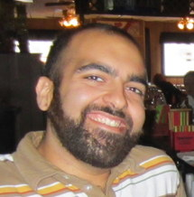](http://www.hotinhere.us/wp-content/uploads/2015/10/3654567.jpg)A student at SEAS (formerly SNRE) from 2008-2010, Paul was fortunate to meet Jennifer and almost immediately be lovingly invited to contribute to the show. Segments like "Paul Explains it All" allowed him to introduce and explain new developments in science and sustainability. He fondly remembers his days in the WCBN booth as some of the finest moments of his Michigan experience, and he's grateful to the entire IHIH family for their efforts, originality, and soul. (day-bow-bow!)

## Owen Johns: Co-Host, Co-Producer, Thresholds (2009)

[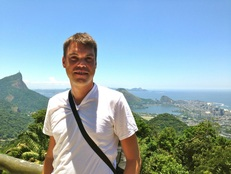](http://www.hotinhere.us/wp-content/uploads/2015/10/9352358.jpg)Owen Johns had the great pleasure to be co-co-host and intermittent contributor to the show in 2009. He introduced more sound effects to the show and created the now-defunct "thresholds" segment. Some of his fondest memories from the show include interviewing Confessions of an Economic Hitman author John Perkins, covering the Bay City coal plant public hearings, and digging through the vaults for environmentally-friendly grooves. After leaving WCBN, he began working for the U.S. State Department in Rio de Janeiro, Brazil, and he still contributes as a research assistant to UM research on water and more in Brazil and beyond.

## Hugh Stimson: Co-Founder, Host, Producer, Archivist UMSEAS student (2008–infamy)

Hugh Stimson is a geoinformatics consultant in beautiful Vancouver, Canada. **One time at a party in Ann Arbor,** he told Jennifer Johnson and Sarah Cweik they should come on his radio show and play some music, and instead they showed up planning to do an environmental talk show, so he went with it.

[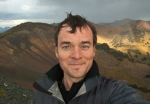](http://www.hotinhere.us/wp-content/uploads/2015/10/3709336.jpg)Hugh has a background in ecology and environmental GIS, and now likes to work with progressive organizations on projects that muddle together science, politics, policy, and public communication. And maps. But not, unfortunately, radio broadcast. He sure does miss radio. (and we miss him!)

## Sarah Cwiek: Co-Founder, Host, Producer, UMSEAS student (and actual radio expert 2008-infamy)

[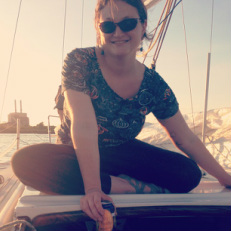](http://www.hotinhere.us/wp-content/uploads/2015/10/1395943700.jpg)Sarah Cwiek came to WCBN with a great deal of on-air and behind-the-scenes radio experience from her work at WDET-101.9 FM-Detroit (Wayne State University). Her smooth and confident guidance that first year or two set our show on its course for success. It is no surprise to hear that she has “moved on up” to NPR affiliate Michigan Radio (91.7 on our FM dials) where she is currently their Detroit reporter.  You can read and listen to Sarah's work [here](http://michiganradio.org/people/sarah-cwiek).

## Aviva Glaser: Co-Host, Co-Producer, Toxic Tangent(ialist)

[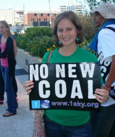](http://www.hotinhere.us/wp-content/uploads/2015/10/1395943833.jpg)Aviva Glaser works in Washington D.C. on food policy and related issues as the [Senior Director for Agricultural Policy for the National Wildlife Federation.](https://www.nwf.org/About-Us/Our-Experts) Aviva once noted on air that her job was "a long term, intricate thing with many setbacks and frustrations, but we celebrate the victories along the way.” We congratulate Aviva on the role she played in achieving Farm Bill victory alongside many other figures including Debbie Stabenow, who provided tireless leadership on this issue.
